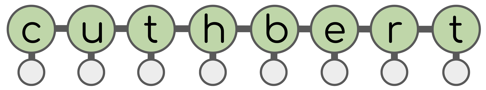

<!--intro-start-->
<div align="center">
</img>
</div>

A JAX library for state-space model inference
(filtering, smoothing, static parameter estimation).

> Disclaimer: The name `cuthbert` was chosen as a playful nod to the well-known
> caterpillar cake rivalry between Aldi and M&S in the UK, as the classic state-space
> model diagram looks vaguely like a caterpillar. However, this software project
> has no formal connection to Aldi, M&S, or any food products (notwithstanding the coffee drunk during its writeup).
> `cuthbert` is simply a fun name for this state-space model library and should not be interpreted as an
> endorsement, association, or affiliation with any brand or animal themed baked goods.
<!--intro-end-->

<!--goals-start-->
### Goals
- Simple, flexible and performant interface for state-space model inference.
- Decoupling of model specification and inference. `cuthbert` is built to swap between
different **inference** methods without be tied to a specific model specification.
- Compose with the [JAX ecosystem](#ecosystem) for extensive external tools.
- Functional API: The only classes in `cuthbert` are `NamedTuple`s and `Protocol`s.
All functions are pure and work seamlessly with `jax.grad`, `jax.jit`, `jax.vmap` etc.
- Methods for filtering: $p(x_t \mid y_{0:t}, \theta)$.
- Methods for smoothing: $p(x_{0:T} \mid y_{0:T}, \theta)$ or $p(x_{t} \mid y_{0:T}, \theta)$.
- Methods for static parameter estimation: $p(\theta \mid y_{0:T})$
or $\text{argmax} p(y_{0:T} \mid \theta)$.
- This includes support for forward-backward/Baum-Welch, particle filtering/sequential Monte Carlo,
Kalman filtering (+ extended/unscented/ensemble), expectation-maximization and more!

### Non-goals
- Tools for defining models and distributions. `cuthbert` is not a probabilistic programming language (PPL).
But can easily compose with [`dynamax`](https://github.com/probml/dynamax), [`distrax`](https://github.com/google-deepmind/distrax), [`numpyro`](https://github.com/pyro-ppl/numpyro) and [`pymc`](https://github.com/pymc-devs/pymc) in a similar way to how [`blackjax` does](https://blackjax-devs.github.io/blackjax/).
- ["SMC Samplers"](https://www.stats.ox.ac.uk/~doucet/delmoral_doucet_jasra_sequentialmontecarlosamplersJRSSB.pdf) which sample from a posterior
distribution which is not (necessarily) a state-space model - [`blackjax` is great for this](https://github.com/blackjax-devs/blackjax/tree/main/blackjax/smc).
<!--goals-end-->

## Codebase structure
<!--codebase-structure-start-->

The codebase is structured as follows:

- `cuthbert`: The main package with unified interface for filtering and smoothing.
- `cuthbertlib`: A collection of atomic, smaller-scoped tools useful for state-space model inference,
that represent the building blocks that power the main `cuthbert` package.
<!--codebase-structure-end-->
- `docs`: Source code for the documentation for `cuthbert` and `cuthbertlib`.
- `tests`: Tests for the `cuthbert` and `cuthbertlib` packages.


<!--installation-start-->
## Installation

`cuthbert` depends on JAX, so you'll need to [install JAX](https://docs.jax.dev/en/latest/installation.html) for the available hardware (CPU, GPU, or TPU).
For example, on computers with NVIDIA GPUs:

```bash
pip install -U "jax[cuda13]"
```

Now install `cuthbert` from PyPI:

```bash
pip install -U cuthbert
```

Installing `cuthbert` will also install `cuthbertlib`.

<!--installation-end-->

<!--ecosystem-start-->
## Ecosystem
- `cuthbert` is built on top of [`jax`](https://github.com/google/jax) and composes
easily with other JAX packages, e.g. [`optax`](https://github.com/google-deepmind/optax)
for optimization, [`flax`](https://github.com/google/flax) for neural networks, and
[`blackjax`](https://github.com/blackjax-devs/blackjax) for (SG)MCMC as well as the PPLs
mentioned [above](#non-goals).
- What about [`dynamax`](https://github.com/probml/dynamax)?
    - `dynamax` is a great library for state-space model specification and inference with
    discrete or Gaussian state-space models. `cuthbert` is focused on inference
    with arbitrary state-space models via  e.g. SMC that is not supported in `dynamax`.
    However as they are both built on [`jax`](https://github.com/google/jax)
    they can be used together! A `dynamax`
    model can be passed to `cuthbert` for inference.
- And [`particles`](https://github.com/nchopin/particles)?
    - [`particles`](https://github.com/nchopin/particles) and the accompanying book
    [Sequential Monte Carlo Methods in Practice](https://link.springer.com/book/10.1007/978-3-030-47845-2)
    are wonderful learning materials for state-space models and SMC.
    `cuthbert` is more focused on performance and composability with the JAX ecosystem.
- Much of the code in `cuthbert` is built on work from [`sqrt-parallel-smoothers`](https://github.com/EEA-sensors/sqrt-parallel-smoothers), [`mocat`](https://github.com/SamDuffield/mocat) and [`abile`](https://github.com/SamDuffield/abile).
<!--ecosystem-end-->

## Contributing

We're always looking for contributions!
Check out the [contributing guide](CONTRIBUTING.md) for more information.

