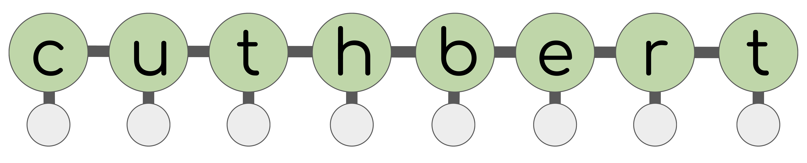

<div align="center">
</img>
</div>

A JAX library for state-space model inference
(filtering, smoothing, static parameter estimation).

> Disclaimer: The name `cuthbert` was chosen as a playful nod to the well-known
> caterpillar cake rivalry between Aldi and M&S in the UK, as the classic state-space
> model diagram looks vaguely like a caterpillar. However, this software project
> has no formal connection to Aldi, M&S, or any food products (notwithstanding the coffee drunk during its writeup).
> `cuthbert` is simply a fun name for this state-space model library and should not be interpreted as an
> endorsement, association, or affiliation with any brand or animal themed baked goods.

### Goals

- Simple, flexible and performant interface for state-space model inference.
- Compose with [JAX ecosystem](#ecosystem) for extensive external tools.
- Functional API: The only classes in `cuthbert` are `NamedTuple`s and [type hints](/cuthbert/types.py).
All functions are pure and work seemingly with `jax.grad`, `jax.jit`, `jax.vmap` etc.
- Unified definition of a state-space model object.
- Methods for filtering: $p(x_t \mid y_{1:t}, \theta)$.
- Methods for smoothing: $p(x_{0:T} \mid y_{1:T}, \theta)$.
- Methods for static parameter estimation: $p(\theta \mid y_{1:T})$
or $\text{argmax} p(y_{1:T} \mid \theta)$.
- This includes forward-backward/Baum-Welch, particle filtering/sequential Monte Carlo,
Kalman filtering (+ extended/unscented/ensemble), expectation-maximization more!

### Non-goals
- Tools for defining models and distributions. `cuthbert` is not a probabilistic programming language (PPL).
But can easily compose with [`dynamax`](https://github.com/probml/dynamax?tab=readme-ov-file#what-are-state-space-models), [`distrax`](https://github.com/google-deepmind/distrax), [`numpyro`](https://github.com/pyro-ppl/numpyro), [`oryx`](https://github.com/microsoft/Oryx) and [`pymc`](https://github.com/pymc-devs/pymc) in a similar way to how [`blackjax` does](https://blackjax-devs.github.io/blackjax/).
- ["SMC Samplers"](https://www.stats.ox.ac.uk/~doucet/delmoral_doucet_jasra_sequentialmontecarlosamplersJRSSB.pdf) which sample from a posterior
distribution which is not (necessarily) a state-space model - [`blackjax` is great for this](https://github.com/blackjax-devs/blackjax/tree/main/blackjax/smc).


## Ecosystem

- `cuthbert` is built on top of [`jax`](https://github.com/google/jax) and composes
easily with other JAX packages, e.g. [`optax`](https://github.com/google-deepmind/optax)
for optimization, [`flax`](https://github.com/google/flax) for neural networks, and
[`blackjax`](https://github.com/blackjax-devs/blackjax) for (SG)MCMC as well as the PPLs
mentioned [above](#non-goals).
- What about [`dynamax`](https://github.com/probml/dynamax?tab=readme-ov-file#what-are-state-space-models)?
    - [`dynamax`](https://github.com/probml/dynamax?tab=readme-ov-file#what-are-state-space-models)
    is a great library for state-space model specification and inference with
    discrete or Gaussian state-space models. `cuthbert` is focused on inference
    with arbitrary state-space models via  e.g. SMC that is not supported in [`dynamax`](https://github.com/probml/dynamax?tab=readme-ov-file#what-are-state-space-models).
    However as they are both built on [`jax`](https://github.com/google/jax)
    they can be used together! A [`dynamax`](https://github.com/probml/dynamax?tab=readme-ov-file#what-are-state-space-models)
    model can be passed to `cuthbert` for inference.
- And [`particles`](https://github.com/nchopin/particles)?
    - [`particles`](https://github.com/nchopin/particles) and the accompanying book
    [Sequential Monte Carlo Methods in Practice](https://link.springer.com/book/10.1007/978-3-030-47845-2)
    are wonderful learning materials for state-space models and SMC.
    `cuthbert` is more focused on performance and composability with the JAX ecosystem.
- Much of the code in `cuthbert` is built on work from
[`mocat`](https://github.com/SamDuffield/mocat), [`abile`](https://github.com/SamDuffield/abile)
and [`bayesfilter`](https://github.com/hugohadfield/bayesfilter).


## Contributing

Feel free to [open an issue](https://github.com/state-space-models/cuthbert/issues)
if you have any questions or suggestions.

Follow these steps to open a pull request (feel free to make it a draft at an 
early stage for feedback):

1. Fork the repo from GitHub and clone it locally:
```
git clone git@github.com/YourUserName/cuthbert.git
cd cuthbert
```
2. Install the cloned version and pre-commit hooks:
```
pip install -e .
pre-commit install
```
3. **Add your code. Add your tests.**  
4. Make sure to run the linter, type checker, tests and check coverage:
```
pre-commit run --all-files
python -m pytest --cov=cuthbert --cov-report term-missing
```
>VS Code users can use the [Ruff](https://marketplace.visualstudio.com/items?itemName=charliermarsh.ruff)
and [Pylance](https://marketplace.visualstudio.com/items?itemName=ms-python.vscode-pylance)
(with Type Checking Mode: standard)
extensions for assistance with linting and type checking during development.
5. Commit your changes and push your new branch to your fork.
6. Open a [pull request on GitHub](https://github.com/state-space-models/cuthbert/pulls).


