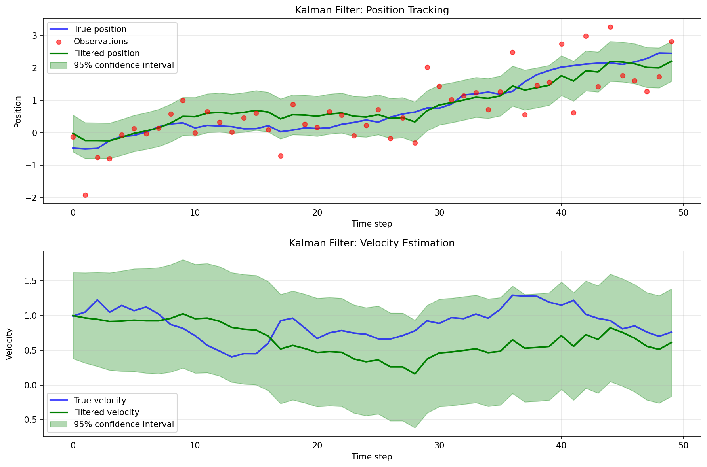

# Dynamax Integration: Kalman Filtering with Linear Gaussian SSM

This example demonstrates how to use a [`dynamax`](https://github.com/probml/dynamax) Linear Gaussian State Space Model (LGSSM) with `cuthbert` to perform fast parallel-in-time Kalman filtering. `dynamax` provides a rich ecosystem for defining state space models, while `cuthbert` offers efficient filtering algorithms.

## Setup and imports

```{.python #dynamax-imports}
import jax.numpy as jnp
import jax.random as jr
from dynamax.linear_gaussian_ssm import LinearGaussianSSM, lgssm_filter
import matplotlib.pyplot as plt

import cuthbert
from cuthbert.gaussian import kalman
```

## Create and initialize a Dynamax Linear Gaussian SSM

Let's create a simple linear Gaussian state space model for tracking a 1D position and velocity over time. This is a classic constant velocity model.

```{.python #dynamax-create-model}
# Model parameters
state_dim = 2  # position and velocity
emission_dim = 1  # we only observe position
num_timesteps = 50
dt = 0.1  # time step

# Create the Linear Gaussian SSM model
lgssm = LinearGaussianSSM(state_dim=state_dim, emission_dim=emission_dim)

# Define dynamics: constant velocity model
# x_t = [position, velocity]
# x_{t+1} = F @ x_t + noise
F = jnp.array([[1.0, dt],
               [0.0, 1.0]])

# Process noise covariance
Q = jnp.array([[0.01, 0.0],
               [0.0, 0.01]])

# Observation model: we only observe position
# y_t = H @ x_t + noise
H = jnp.array([[1.0, 0.0]])

# Observation noise covariance
R = jnp.array([[0.5]])

# Initial state distribution
m0 = jnp.array([0.0, 1.0])  # start at position 0 with velocity 1
P0 = jnp.eye(state_dim) * 0.1

# Initialize model parameters with our custom values
key = jr.PRNGKey(42)
params, props = lgssm.initialize(
    key=key,
    initial_mean=m0,
    initial_covariance=P0,
    dynamics_weights=F,
    dynamics_covariance=Q,
    emission_weights=H,
    emission_covariance=R
)

print(f"Dynamics matrix F:\n{params.dynamics.weights}")
print(f"Observation matrix H:\n{params.emissions.weights}")
```

Running the above code yields
```txt
Dynamics matrix F:
[[1.  0.1]
 [0.  1. ]]
Observation matrix H:
[[1. 0.]]
```

## Generate sample data

Now we'll sample a sequence of observations from the model:

```{.python #dynamax-generate-data}
# Sample from the model
key, sample_key = jr.split(key)
true_states, observations = lgssm.sample(params, sample_key, num_timesteps)

print(f"Generated {len(observations)} observations")
print(f"True states shape: {true_states.shape}")
print(f"Observations shape: {observations.shape}")
print(f"First 5 observations: {observations[:5].flatten()}")
```

Running the above code yields
```txt
Generated 50 observations
True states shape: (50, 2)
Observations shape: (50, 1)
First 5 observations: [-0.12673497 -1.9195632  -0.7634685  -0.7985211  -0.06220094]
```


## Build `cuthbert` Kalman filter from `dynamax` model

The key to integrating `dynamax` with `cuthbert` is to extract the model matrices and wrap them in `cuthbert`'s parameter extraction functions.

```{.python #dynamax-build-cuthbert-filter}
def build_cuthbert_kalman_filter_from_dynamax(lgssm_model, lgssm_params, observations):
    """Build a cuthbert Kalman filter from a dynamax Linear Gaussian SSM.
    
    Args:
        lgssm_model: The dynamax LinearGaussianSSM model object
        lgssm_params: The parameters of the LGSSM
        observations: The observation sequence
        
    Returns:
        filter_obj: A cuthbert Filter object
        model_inputs: Time indices for filtering
    """
    
    # Extract parameters from dynamax model
    m0 = lgssm_params.initial.mean
    chol_P0 = jnp.linalg.cholesky(lgssm_params.initial.cov)
    
    F = lgssm_params.dynamics.weights
    c = lgssm_params.dynamics.bias
    chol_Q = jnp.linalg.cholesky(lgssm_params.dynamics.cov)
    
    H = lgssm_params.emissions.weights
    d = lgssm_params.emissions.bias
    chol_R = jnp.linalg.cholesky(lgssm_params.emissions.cov)
    
    def get_init_params(model_inputs):
        """Return initial state distribution parameters."""
        return m0, chol_P0
    
    def get_dynamics_params(model_inputs):
        """Return dynamics parameters (same for all time steps)."""
        return F, c, chol_Q
    
    def get_observation_params(model_inputs):
        """Return observation parameters and the observation at time t."""
        t = model_inputs
        y_t = observations[t]
        return H, d, chol_R, y_t
    
    # Build the Kalman filter
    filter_obj = kalman.build_filter(
        get_init_params=get_init_params,
        get_dynamics_params=get_dynamics_params,
        get_observation_params=get_observation_params
    )
    
    # Model inputs are just time indices
    model_inputs = jnp.arange(len(observations))
    
    return filter_obj, model_inputs

# Create the cuthbert Kalman filter
filter_obj, model_inputs = build_cuthbert_kalman_filter_from_dynamax(lgssm, params, observations)
```

## Run the Kalman filter

Now we can run the `cuthbert` Kalman filter to obtain the filtering distributions:

```{.python #dynamax-run-filter}
# Run Kalman filtering
filtered_states = cuthbert.filter(filter_obj, model_inputs)

# Extract filtering results
filtered_means = filtered_states.mean
filtered_chol_covs = filtered_states.chol_cov
log_likelihoods = filtered_states.log_normalizing_constant
total_log_likelihood = log_likelihoods[-1]

print(f"Filtered means shape: {filtered_means.shape}")
print(f"Total log likelihood: {total_log_likelihood:.2f}")
print(f"First 5 filtered positions: {filtered_means[:5, 0]}")

# Compute filtering covariances from Cholesky factors
filtered_covs = jnp.einsum('tij,tkj->tik', filtered_chol_covs, filtered_chol_covs)
```

Running the above code yields
```txt
Filtered means shape: (50, 2)
Total log likelihood: -55.41
First 5 filtered positions: [-0.0211225  -0.2383174  -0.23843466 -0.24582891 -0.13977882]
```


## Compare with `dynamax` filtering

Let's verify our results match `dynamax`'s built-in Kalman filtering:

```{.python #dynamax-compare}
# Run dynamax's Kalman filter for comparison
dynamax_posterior = lgssm_filter(params, observations)
dynamax_filtered_means = dynamax_posterior.filtered_means
dynamax_filtered_covs = dynamax_posterior.filtered_covariances

# Compare means
mean_max_diff = jnp.max(jnp.abs(filtered_means - dynamax_filtered_means))
print(f"Maximum difference in filtered means: {mean_max_diff:.2e}")

# Compare covariances
cov_max_diff = jnp.max(jnp.abs(filtered_covs - dynamax_filtered_covs))
print(f"Maximum difference in filtered covariances: {cov_max_diff:.2e}")

# Compare log likelihoods
dynamax_log_likelihood = dynamax_posterior.marginal_loglik
print(f"cuthbert log likelihood: {total_log_likelihood:.2f}")
print(f"dynamax log likelihood: {dynamax_log_likelihood:.2f}")
print(f"Difference: {abs(total_log_likelihood - dynamax_log_likelihood):.2e}")
```

Running the above code yields
```txt
Maximum difference in filtered means: 4.77e-07
Maximum difference in filtered covariances: 1.19e-07
cuthbert log likelihood: -55.41
dynamax log likelihood: -55.41
Difference: 2.29e-05
```

## Visualize results

Finally, let's visualize the filtering results:



??? quote "Code to plot the filtering results"
    ```{.python #dynamax-visualize}
    fig, axes = plt.subplots(2, 1, figsize=(12, 8))
    
    # Extract position and velocity
    true_positions = true_states[:, 0]
    true_velocities = true_states[:, 1]
    filtered_positions = filtered_means[:, 0]
    filtered_velocities = filtered_means[:, 1]
    
    # Compute 95% confidence intervals for position
    position_stds = jnp.sqrt(filtered_covs[:, 0, 0])
    upper_bound = filtered_positions + 1.96 * position_stds
    lower_bound = filtered_positions - 1.96 * position_stds
    
    # Plot position over time
    ax = axes[0]
    time_steps = jnp.arange(num_timesteps)
    ax.plot(time_steps, true_positions, 'b-', label='True position', linewidth=2, alpha=0.7)
    ax.scatter(time_steps, observations.flatten(), c='red', s=30, 
              label='Observations', alpha=0.6, zorder=5)
    ax.plot(time_steps, filtered_positions, 'g-', label='Filtered position', linewidth=2)
    ax.fill_between(time_steps, lower_bound, upper_bound, alpha=0.3, color='green',
                    label='95% confidence interval')
    ax.set_xlabel('Time step')
    ax.set_ylabel('Position')
    ax.set_title('Kalman Filter: Position Tracking')
    ax.legend()
    ax.grid(True, alpha=0.3)
    
    # Plot velocity over time
    ax = axes[1]
    velocity_stds = jnp.sqrt(filtered_covs[:, 1, 1])
    velocity_upper = filtered_velocities + 1.96 * velocity_stds
    velocity_lower = filtered_velocities - 1.96 * velocity_stds
    
    ax.plot(time_steps, true_velocities, 'b-', label='True velocity', linewidth=2, alpha=0.7)
    ax.plot(time_steps, filtered_velocities, 'g-', label='Filtered velocity', linewidth=2)
    ax.fill_between(time_steps, velocity_lower, velocity_upper, alpha=0.3, color='green',
                    label='95% confidence interval')
    ax.set_xlabel('Time step')
    ax.set_ylabel('Velocity')
    ax.set_title('Kalman Filter: Velocity Estimation')
    ax.legend()
    ax.grid(True, alpha=0.3)
    
    plt.tight_layout()
    plt.savefig('docs/assets/dynamax_integration.png', dpi=150, bbox_inches='tight')
    print("Visualization saved to docs/assets/dynamax_integration.png")
    plt.close()
    ```

## Key takeaways

- **Seamless integration**: `dynamax` Linear Gaussian SSMs can be easily used with `cuthbert`'s efficient Kalman filtering algorithms
- **Parameter extraction pattern**: The key is extracting `dynamax` model parameters (F, Q, H, R, etc.) and wrapping them in `cuthbert`'s parameter extraction functions
- **Square-root filtering**: `cuthbert` uses Cholesky factors for numerical stability, which we compute from `dynamax`'s covariance matrices
- **Consistent results**: `cuthbert` and `dynamax` produce identical filtering distributions (up to numerical precision)

This integration pattern works for any Linear Gaussian State Space Model in `dynamax`. For nonlinear models, you could similarly integrate `dynamax`'s representation with, e.g., `cuthbert`'s particle filters or extended Kalman filters.


<!--- entangled-tangle-block
```{.python file=examples_scripts/dynamax_integration.py}
<<dynamax-imports>>
<<dynamax-create-model>>
<<dynamax-generate-data>>
<<dynamax-build-cuthbert-filter>>
<<dynamax-run-filter>>
<<dynamax-compare>>
<<dynamax-visualize>>
```
-->

