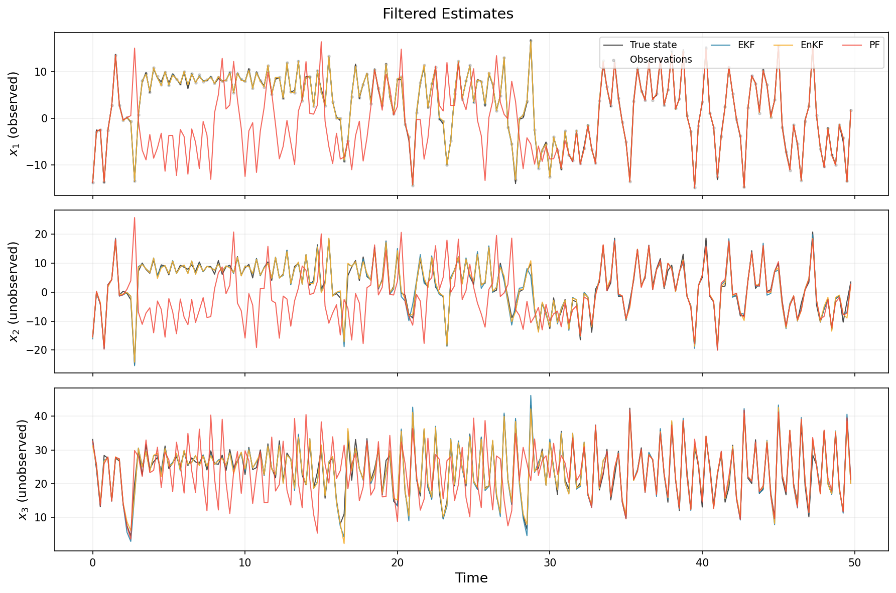
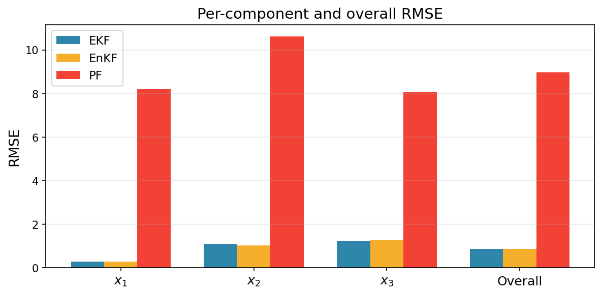
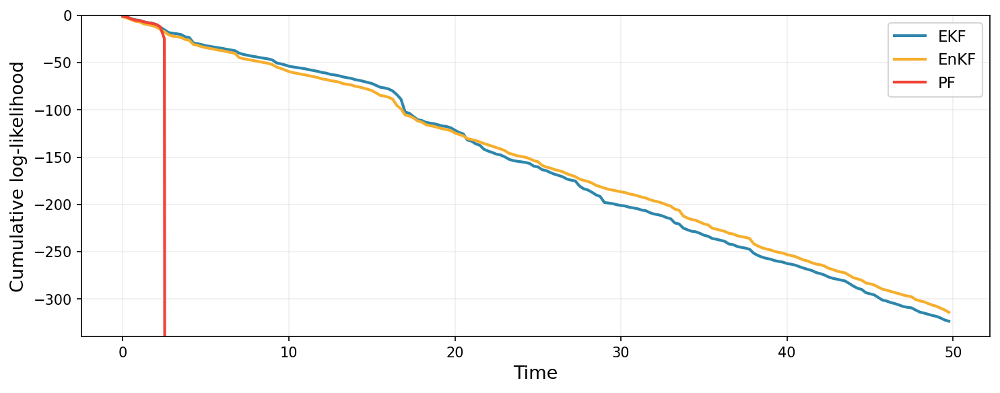
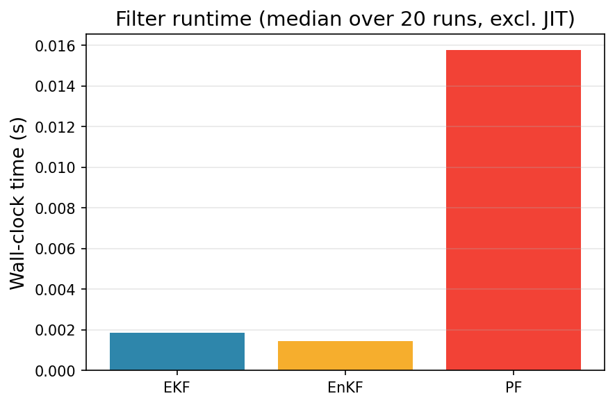

# Filtering Lorenz-63 With An Ensemble Kalman Filter

In this example, we use the ensemble Kalman filter (EnKF) to filter a partially-observed stochastic Lorenz-63 dynamical system. We compare to the EKF (linearized via Taylor linearization) and a bootstrap particle filter. We observe **only the first component** $x_1$ with Gaussian noise, and must infer all three states. This is a difficult but theoretically-tractable task.

## The model

We define the classical Lorenz 63 system, and augment it with a small diffusion term, resulting in the SDE:

$$
d\mathbf{x} = \begin{pmatrix} \sigma(x_2 - x_1) \\ x_1(\rho - x_3) - x_2 \\ x_1 x_2 - \beta x_3 \end{pmatrix} dt + \sigma_{\text{diff}} \, d\mathbf{W}_t
$$

with the standard chaotic parameters $\sigma = 10$, $\rho = 28$, $\beta = 8/3$.
We discretize the drift with Heun's method using a fine inner step size $\delta t = 0.01$ and assimilate every 25 inner steps ($\Delta t = 0.25$). This large assimilation interval makes EKF linearization of the composed multi-step map inaccurate, while the EnKF simply propagates ensemble members through the same nonlinear map without any Jacobian.

$$
y_t = \begin{pmatrix} 1 & 0 & 0 \end{pmatrix} \mathbf{x}_t + \varepsilon_t, \quad \varepsilon_t \sim \mathcal{N}(0, \sigma_{\text{obs}}^2).
$$

## Setup and imports

```{.python #enkf-comparison-imports}
import time

import jax
import jax.numpy as jnp
import matplotlib.pyplot as plt
from jax import jit, random

from cuthbert import filter as run_filter
from cuthbert.enkf import ensemble_kalman_filter
from cuthbert.gaussian import taylor
from cuthbert.gaussian.types import LinearizedKalmanFilterState
from cuthbert.smc import particle_filter
from cuthbertlib.resampling import adaptive, systematic
from cuthbertlib.stats.multivariate_normal import logpdf
from cuthbertlib.types import LogConditionalDensity
```

## Define the Lorenz-63 dynamics

```{.python #enkf-comparison-generate}
jax.config.update("jax_enable_x64", True)

# Lorenz-63 parameters
lorenz_sigma = 10.0
lorenz_rho = 28.0
lorenz_beta = 8.0 / 3.0

# Discretization and noise
dt_inner = 0.01
n_inner_steps = 25
dt = dt_inner * n_inner_steps
diff_std = 1.0  # Diffusion noise standard deviation
obs_std = 0.3   # Observation noise standard deviation

x_dim = 3
y_dim = 1


def lorenz_drift(x):
    """Lorenz-63 drift function."""
    return jnp.array(
        [
            lorenz_sigma * (x[1] - x[0]),
            x[0] * (lorenz_rho - x[2]) - x[1],
            x[0] * x[1] - lorenz_beta * x[2],
        ]
    )


def lorenz_step(x):
    """Advance one assimilation interval with Heun integration."""

    def body(_, x_curr):
        k1 = lorenz_drift(x_curr)
        x_pred = x_curr + dt_inner * k1
        k2 = lorenz_drift(x_pred)
        return x_curr + 0.5 * dt_inner * (k1 + k2)

    return jax.lax.fori_loop(0, n_inner_steps, body, x)


# Noise covariances
Q = (diff_std**2 * dt) * jnp.eye(x_dim)
chol_Q = jnp.linalg.cholesky(Q)
R = (obs_std**2) * jnp.eye(y_dim)
chol_R = jnp.linalg.cholesky(R)

# Observation model: observe only x_1
H = jnp.array([[1.0, 0.0, 0.0]])
d_obs = jnp.zeros(y_dim)

# Simulate ground truth
num_time_steps = 200
key = random.key(0)

# Spin up to reach the attractor
x = jnp.array([1.0, 1.0, 1.0])
for _ in range(1_000):
    key, dyn_key = random.split(key)
    x = lorenz_step(x) + chol_Q @ random.normal(dyn_key, (x_dim,))

# Initial distribution centered near the attractor
m0 = x
P0 = 2.0 * jnp.eye(x_dim)
chol_P0 = jnp.linalg.cholesky(P0)

# Now simulate with observations
xs, ys = [], []
for t in range(num_time_steps):
    key, dyn_key, obs_key = random.split(key, 3)
    x = lorenz_step(x) + chol_Q @ random.normal(dyn_key, (x_dim,))
    y = H @ x + d_obs + chol_R @ random.normal(obs_key, (y_dim,))
    xs.append(x)
    ys.append(y)

true_states = jnp.stack(xs)
ys = jnp.stack(ys)
times = jnp.arange(num_time_steps) * dt

model_inputs = jnp.arange(num_time_steps + 1)
```

## EKF (Taylor linearization)

We'll use an EKF through the [`taylor` submodule](../api_cuthbert/gaussian/taylor.md). For this, we need to specify an initial log density, dynamics log-density, observable log-density, and linearization points for each.

```{.python #enkf-comparison-ekf}
def get_init_log_density(model_inputs):
    def init_log_density(x):
        return logpdf(x, m0, chol_P0, nan_support=False)

    return init_log_density, m0


def get_dynamics_log_density(
    state: LinearizedKalmanFilterState, model_inputs
) -> tuple[LogConditionalDensity, jnp.ndarray, jnp.ndarray]:
    lin_point = state.mean

    def dynamics_log_density(x_prev, x):
        return logpdf(x, lorenz_step(x_prev), chol_Q, nan_support=False)

    return dynamics_log_density, lin_point, lorenz_step(lin_point)


def get_observation_func(
    state: LinearizedKalmanFilterState, model_inputs
) -> tuple[LogConditionalDensity, jnp.ndarray, jnp.ndarray]:
    idx = model_inputs - 1

    def obs_log_density(x, y):
        return logpdf(y, H @ x + d_obs, chol_R, nan_support=False)

    return obs_log_density, state.mean, ys[idx]


ekf = taylor.build_filter(
    get_init_log_density,
    get_dynamics_log_density,
    get_observation_func,
    associative=False,
)

jitted_filter = jit(run_filter, static_argnames=["filter_obj"])

n_timing = 20
ekf_states = jitted_filter(ekf, model_inputs)  # warm up
jax.block_until_ready(ekf_states)
_times = []
for _ in range(n_timing):
    _t0 = time.perf_counter()
    jax.block_until_ready(jitted_filter(ekf, model_inputs))
    _times.append(time.perf_counter() - _t0)
ekf_time = float(jnp.median(jnp.array(_times)))

ekf_means = ekf_states.mean
ekf_chol_covs = ekf_states.chol_cov
```

## EnKF

The EnKF propagates an ensemble of particles through the nonlinear dynamics directly. It then performs a Kalman-style update using empirical covariances of these particles. It does not need to compute a Jacobian of the dynamics, unlike the EKF.

```{.python #enkf-comparison-enkf}
enkf = ensemble_kalman_filter.build_filter(
    get_init_params=lambda mi: (m0, chol_P0),
    dynamics_fn=lambda x, mi: lorenz_step(x),
    get_dynamics_params=lambda mi: chol_Q,
    observation_fn=lambda x, mi: H @ x + d_obs,
    get_observation_params=lambda mi: (chol_R, ys[mi - 1]),
    n_particles=25,
    inflation=0.05,
    perturbed_obs=True,
)

key, enkf_key = random.split(key)
enkf_states = jitted_filter(enkf, model_inputs, key=enkf_key)  # warm up
jax.block_until_ready(enkf_states)
_times = []
for _ in range(n_timing):
    _t0 = time.perf_counter()
    jax.block_until_ready(jitted_filter(enkf, model_inputs, key=enkf_key))
    _times.append(time.perf_counter() - _t0)
enkf_time = float(jnp.median(jnp.array(_times)))

enkf_means = enkf_states.mean
```

## Bootstrap particle filter

The bootstrap particle filter makes no Gaussian assumption. However, empirically speaking, it requires many more particles than the corresponding EnKF when the EnKF works well. For illustration purposes, we thus use `n_filter_particles = 125`, i.e., 5x the number of particles used for EnKF.

```{.python #enkf-comparison-pf}
adaptive_systematic = adaptive.ess_decorator(systematic.resampling, 0.5)

pf = particle_filter.build_filter(
    init_sample=lambda key, mi: m0 + chol_P0 @ random.normal(key, (x_dim,)),
    propagate_sample=lambda key, state, mi: lorenz_step(state)
    + chol_Q @ random.normal(key, (x_dim,)),
    log_potential=lambda s_prev, s, mi: logpdf(
        ys[mi - 1], H @ s + d_obs, chol_R, nan_support=False
    ),
    n_filter_particles=125,
    resampling_fn=adaptive_systematic,
)

key, pf_key = random.split(key)
pf_states = jitted_filter(pf, model_inputs, key=pf_key)  # warm up
jax.block_until_ready(pf_states)
_times = []
for _ in range(n_timing):
    _t0 = time.perf_counter()
    jax.block_until_ready(jitted_filter(pf, model_inputs, key=pf_key))
    _times.append(time.perf_counter() - _t0)
pf_time = float(jnp.median(jnp.array(_times)))

pf_weights = jax.nn.softmax(pf_states.log_weights, axis=-1)
pf_means = jnp.sum(pf_states.particles * pf_weights[..., None], axis=-2)
```

## Compare state estimates

We plot the three state components over time. Remember that only $x_1$ is
observed — the filters must infer $x_2$ and $x_3$ from the dynamics alone.

??? "Code to plot state trajectories."
    ```{.python #enkf-comparison-plot}
    fig, axes = plt.subplots(3, 1, figsize=(12, 8), sharex=True)

    dim_labels = ["$x_1$ (observed)", "$x_2$ (unobserved)", "$x_3$ (unobserved)"]

    for i, ax in enumerate(axes):
        # True state
        ax.plot(
            times, true_states[:, i], "k-", linewidth=1.0, label="True state", alpha=0.7
        )

        # Observations (only for x_1)
        if i == 0:
            ax.scatter(
                times,
                ys[:, 0],
                s=5,
                color="gray",
                alpha=0.3,
                label="Observations",
                zorder=1,
            )

        # EKF
        ax.plot(
            times,
            ekf_means[1:, i],
            color="#2E86AB",
            linewidth=1.0,
            label="EKF",
            alpha=0.9,
        )

        # EnKF
        ax.plot(
            times,
            enkf_means[1:, i],
            color="#F6AE2D",
            linewidth=1.0,
            label="EnKF",
            alpha=0.9,
        )

        # PF
        ax.plot(
            times,
            pf_means[1:, i],
            color="#F24236",
            linewidth=1.0,
            label="PF",
            alpha=0.8,
        )

        ax.set_ylabel(dim_labels[i], fontsize=12)
        ax.grid(True, alpha=0.2)

    axes[0].legend(loc="upper right", fontsize=9, ncol=4)
    axes[2].set_xlabel("Time", fontsize=13)
    fig.suptitle("Filtered Estimates", fontsize=14)
    fig.tight_layout()
    fig.savefig("docs/assets/enkf_comparison.png", dpi=150, bbox_inches="tight")
    plt.close()
    ```




From these results, we can clearly see that the PF struggled, despite the larger number of particles. In this example, using ~250 particles would have helped, but with higher computational cost. The EKF and EnKF perform similarly, despite the low-dimensional setting being relatively well-suited for the EKF.

## Metric Comparison

Aside from visual comparisons, we can also compute metrics like RMSE and log-likelihood of the filtered estimates. 

We begin with RMSE of the mean prediction vs. ground truth.

??? "Code to compute and plot RMSE."
    ```{.python #enkf-comparison-rmse}
    def rmse(estimates, truth):
        return jnp.sqrt(jnp.nanmean((estimates - truth) ** 2, axis=0))


    ekf_rmses = rmse(ekf_means[1:], true_states)
    enkf_rmses = rmse(enkf_means[1:], true_states)
    pf_rmses = rmse(pf_means[1:], true_states)

    component_names = ["$x_1$", "$x_2$", "$x_3$", "Overall"]
    ekf_vals = [*ekf_rmses.tolist(), float(jnp.mean(ekf_rmses))]
    enkf_vals = [*enkf_rmses.tolist(), float(jnp.mean(enkf_rmses))]
    pf_vals = [*pf_rmses.tolist(), float(jnp.mean(pf_rmses))]

    x = jnp.arange(len(component_names))
    width = 0.25

    fig, ax = plt.subplots(figsize=(8, 4))
    ax.bar(x - width, ekf_vals, width, label="EKF", color="#2E86AB")
    ax.bar(x, enkf_vals, width, label="EnKF", color="#F6AE2D")
    ax.bar(x + width, pf_vals, width, label="PF", color="#F24236")

    ax.set_xticks(x)
    ax.set_xticklabels(component_names, fontsize=12)
    ax.set_ylabel("RMSE", fontsize=13)
    ax.set_title("Per-component and overall RMSE", fontsize=14)
    ax.legend(fontsize=11)
    ax.grid(True, axis="y", alpha=0.3)
    fig.tight_layout()
    fig.savefig("docs/assets/enkf_comparison_rmse.png", dpi=150, bbox_inches="tight")
    plt.close()
    ```



The cumulative log-likelihood (log normalizing constant) is a probabilistic estimate of how well each filter predicts the observations.

??? "Code to plot cumulative log-likelihood."
    ```{.python #enkf-comparison-loglik}
    fig, ax = plt.subplots(figsize=(10, 4))

    ax.plot(
        times,
        ekf_states.log_normalizing_constant[1:],
        color="#2E86AB",
        linewidth=2,
        label="EKF",
    )
    ax.plot(
        times,
        enkf_states.log_normalizing_constant[1:],
        color="#F6AE2D",
        linewidth=2,
        label="EnKF",
    )
    ax.plot(
        times,
        pf_states.log_normalizing_constant[1:],
        color="#F24236",
        linewidth=2,
        label="PF",
    )

    ax.set_xlabel("Time", fontsize=13)
    ax.set_ylabel("Cumulative log-likelihood", fontsize=13)
    ax.set_ylim(bottom=float(ekf_states.log_normalizing_constant[1:].min()) * 1.05, top=0.0)
    ax.legend(fontsize=11)
    ax.grid(True, alpha=0.2)
    fig.tight_layout()
    fig.savefig("docs/assets/enkf_comparison_loglik.png", dpi=150, bbox_inches="tight")
    plt.close()

    print(f"Final log-likelihood — EKF:  {ekf_states.log_normalizing_constant[-1]:.2f}")
    print(f"Final log-likelihood — EnKF: {enkf_states.log_normalizing_constant[-1]:.2f}")
    print(f"Final log-likelihood — PF:   {pf_states.log_normalizing_constant[-1]:.2f}")
    ```



In both metrics, the EnKF slightly outperformed the EKF, whilst the PF suffers.

## Runtime comparison

One benefit of the EnKF is its ability to handle nonlinear dynamics with relatively low computational cost. Indeed, the EKF must compute a Jacobian at every time point, and the PF typically relies on a large number of particles to maintain accuracy. Let us compare the time it took to run each filter (not counting time to JIT).

??? "Code to plot runtime comparison."
    ```{.python #enkf-comparison-timing}
    fig, ax = plt.subplots(figsize=(6, 4))

    filter_names = ["EKF", "EnKF", "PF"]
    run_times = [ekf_time, enkf_time, pf_time]
    colors = ["#2E86AB", "#F6AE2D", "#F24236"]

    ax.bar(filter_names, run_times, color=colors)
    ax.set_ylabel("Wall-clock time (s)", fontsize=13)
    ax.set_title(f"Filter runtime (median over {n_timing} runs, excl. JIT)", fontsize=14)
    ax.grid(True, axis="y", alpha=0.3)
    fig.tight_layout()
    fig.savefig("docs/assets/enkf_comparison_timing.png", dpi=150, bbox_inches="tight")
    plt.close()
    ```




## Key Takeaways

- **Lorenz-63 with a large assimilation interval** ($\Delta t = 0.25$) is a regime where the EKF breaks down: the
  linearization of the 25-step composed map is highly inaccurate near the
  attractor's saddle points.
- **EnKF** handles this naturally — each ensemble member is propagated through
  the same nonlinear multi-step integrator, with no Jacobian required. The ensemble covariances capture the true non-Gaussian predictive uncertainty.
- **Particle filter** makes no Gaussian assumption but can suffer at large $\Delta t$ without more particle: the bootstrap proposal is the dynamics prior which becomes broad relative to the likelihood at long intervals.
- **Unified API benefit**: switching between EKF, EnKF, and PF only changes the filter construction — the simulation, observation, and plotting code is shared.

## Next Steps

- **Play With `dt`**: Shrink `n_inner_steps` toward 1–2 steps to see the EKF recover as linearization becomes accurate again, or raise it further and see EKF completely collapse.
- **Parameter learning**: Use `jax.grad` through the EnKF's differentiable log-likelihood to learn Lorenz-63 parameters ($\sigma$, $\rho$, $\beta$) from data.
- **More examples**: Check out the other [examples](index.md).


<!--- entangled-tangle-block
```{.python file=examples_scripts/enkf_comparison.py}
<<enkf-comparison-imports>>
<<enkf-comparison-generate>>
<<enkf-comparison-ekf>>
<<enkf-comparison-enkf>>
<<enkf-comparison-pf>>
<<enkf-comparison-plot>>
<<enkf-comparison-rmse>>
<<enkf-comparison-loglik>>
<<enkf-comparison-timing>>
```
-->
