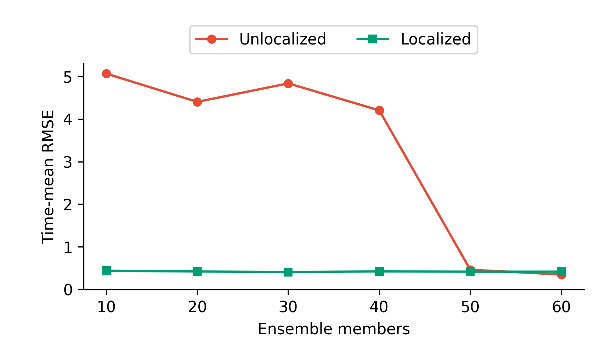
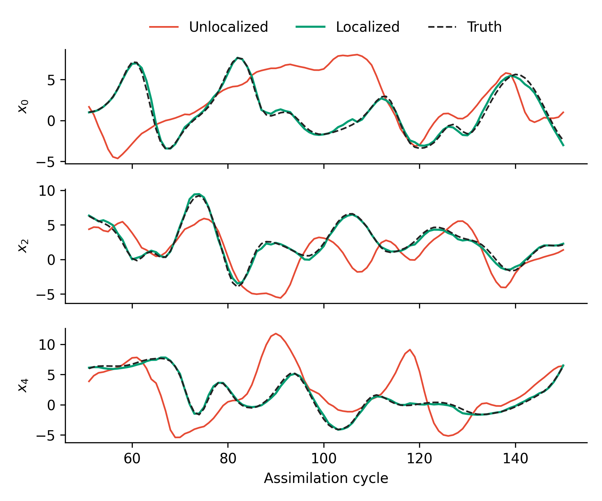
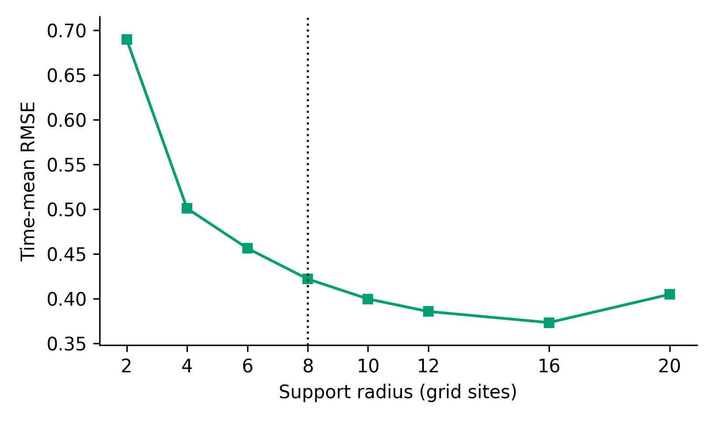

# Localization for the EnKF

The ensemble Kalman filter (EnKF) is a powerful tool for analysis in state-space models with a large state, and potentially nonlinear dynamics. The EnKF works by maintainng a set of particles (the ensemble) that evolve through time using an empirical version of the Kalman gain, computed using the ensemble. 

A common use case for the EnKF is in large state spaces, with dozens of particles but hundreds or thousands of dimensions, $N \ll d$. This results in a difficult statistical problem, where one must estimate (factors of) a $d \times d$ matrix with $N \ll d$ samples. Noise in the resulting covariance matrices can greatly influence the resulting filter dynamics.

One technique to cope with this problem is *localization*; many different forms of localization are available, but many common forms reduce to applying a taper to the covariance matrix. We are therefore _localizing_ the estimated correlations according to some _a priori_ belief on possible correlation. Putting such a structure on correlations is often reasonable in settings where the entries of the state vector correspond to physical coordinates, where we know correlations at large distances are unlikely, e.g., weather systems.

In this tutorial, we illustrate how one can apply localization via covariance tapering in `cuthbert` in a standard example on Lorenz-96 dynamics. We use the Gaspari-Cohn correlation function to perform localization, and show how a naïve EnKF implementation collapses with a small number of particles, whereas a localized version performs well even with small ensemble sizes.

## The Lorenz–96 System

We use the [Lorenz-96](https://en.wikipedia.org/wiki/Lorenz_96_model) system as an illustrative testbed (and standard example). Lorenz-96 is useful as it allows us to a high dimensional dynamical system, with the property that only "nearby" entries of the state vector should be highly correlated. 

In $d$ dimensions, we define the Lorenz-96 system as follows:

$$
\frac{\mathrm d x_i}{\mathrm d t}
= (x_{i+1}-x_{i-2})x_{i-1}-x_i+F,
$$

where indices wrap around (so, e.g., $x_{0-1} = x_d$). While the differential depends only on local quantities $(x_{i-1}, x_{i+1}, x_{i+2})$, the Lorenz-96 system has chaotic dynamics that share information across all states as $t$ advances. 

We use a standard setup of $d=40$ and $F=8$, discretize with $\Delta t = 0.05$, and use noisy observations of every second component:

$$
y_{t,j}=x_{t,2j}+\varepsilon_{t,j},
\qquad \varepsilon_{t,j}\sim\mathcal N(0,1).
$$

## Imports and Configuration

```{.python #enkf-localization-l96-imports}
import jax
import jax.numpy as jnp
import matplotlib.pyplot as plt
from jax import lax, random

from cuthbert import filter as run_filter
from cuthbert.ensemble_kalman import ensemble_kalman_filter
from cuthbertlib.ensemble_kalman import CovarianceTapers, gaspari_cohn

plt.switch_backend("Agg")
jax.config.update("jax_enable_x64", True)
```

We integrate the discretized dynamics with a  fourth-order Runge–Kutta solver of step length
$0.01$ between observations:

```{.python #enkf-localization-l96-model}
state_dim = 40
forcing = 8.0
inner_step_size = 0.01
inner_steps_per_observation = 5
assimilation_interval = inner_step_size * inner_steps_per_observation

num_time_steps = 500
ensemble_sizes = (10, 20, 30, 40, 50, 60)
observation_indices = jnp.arange(0, state_dim, 2)
observation_dim = observation_indices.size
observation_std = 1.0
inflation = 0.05


def lorenz96_rhs(state):
    return (
        (jnp.roll(state, -1) - jnp.roll(state, 2)) * jnp.roll(state, 1)
        - state
        + forcing
    )


def rk4_step(state):
    k1 = lorenz96_rhs(state)
    k2 = lorenz96_rhs(state + 0.5 * inner_step_size * k1)
    k3 = lorenz96_rhs(state + 0.5 * inner_step_size * k2)
    k4 = lorenz96_rhs(state + inner_step_size * k3)
    return state + inner_step_size * (k1 + 2 * k2 + 2 * k3 + k4) / 6


def lorenz96_step(state):
    return lax.fori_loop(
        0,
        inner_steps_per_observation,
        lambda _, current: rk4_step(current),
        state,
    )


```

## Simulating Data

For proper benchmarking, we follow a procedure where we first "warm-up" the dynamical system, so that we sample from the invariant measure of the system, then collect "climatology" samples. The point of the latter is to assume they are approximately distributed accordingly to the invariant measure of the system, and can surve as a prior.

```{.python #enkf-localization-l96-simulate}
initial_state = forcing * jnp.ones(state_dim)
initial_state = initial_state.at[0].add(0.01)


def simulate_step(state, _):
    next_state = lorenz96_step(state)
    return next_state, next_state


_, trajectory = lax.scan(
    simulate_step,
    initial_state,
    None,
    length=10_000,
)

climatology_states = trajectory[2_000:]

initial_truth = climatology_states[-1]
_, true_states = lax.scan(
    simulate_step,
    initial_truth,
    None,
    length=num_time_steps,
)

observation_key, _, init_key, filter_key = random.split(random.key(1337), 4)
observations = true_states[:, observation_indices] + observation_std * random.normal(
    observation_key,
    (num_time_steps, observation_dim),
)

chol_observation_covariance = observation_std * jnp.eye(observation_dim)
```

## Building a Covariance Taper

The shortest distance between indices $i, j$ in the periodic domain of Lorenz-96 is

$$
d_{\mathrm{ring}}(i,j)=\min\{|i-j|,\,40-|i-j|\}.
$$

We build a covariance taper for localization that uses this distance and the Gaspari-Cohn correlation function. The resulting correlation function reduces correlations based on this distance, and sets $\rho_{ij} = 0$ if the distance is larger than the hyperparameter `supper_radius`.

```{.python #enkf-localization-l96-tapers}
support_radius = 8.0
state_locations = jnp.arange(state_dim)


def periodic_distance(left, right):
    """Return pairwise shortest distances on the Lorenz–96 ring."""
    direct = jnp.abs(left[:, None] - right[None, :])
    return jnp.minimum(direct, state_dim - direct)


state_distances = periodic_distance(state_locations, state_locations)


def make_filter_tapers(radius):
    state_taper = gaspari_cohn(state_distances, radius)
    return CovarianceTapers(
        cross=state_taper[:, observation_indices],
        marginal=state_taper[
            observation_indices[:, None],
            observation_indices[None, :],
        ],
    )


filter_tapers = make_filter_tapers(support_radius)


def get_covariance_tapers(_model_inputs):
    return filter_tapers
```

Tapers in `cuthbert` will always require `cross`, which is the taper for the covariance matrix $C_{xy}$. Tapers for the marginal (observation) covariance, $C_{yy}$, are optional and can be passed with `marginal` or as `None`. 

## Comparing Localized vs. Unlocalized Filters

We now compare a localized and unlocalized (stochastic) EnKF on the generated data. We build each EnKF as follows:

```{.python #enkf-localization-l96-filter}
def init_sample(key, _model_inputs):
    index = random.randint(key, (), 0, climatology_states.shape[0])
    return climatology_states[index]


def get_dynamics(_model_inputs):
    return lambda state, _key: lorenz96_step(state)


def get_observations(observation):
    return (
        lambda state: state[observation_indices],
        chol_observation_covariance,
        observation,
    )


def build_enkf(n_members, taper_callback=None):
    return ensemble_kalman_filter.build_filter(
        init_sample=init_sample,
        get_dynamics=get_dynamics,
        get_observations=get_observations,
        n_particles=n_members,
        inflation=inflation,
        perturbed_obs=True,
        get_covariance_tapers=taper_callback,
    )

jitted_filter = jax.jit(run_filter, static_argnames=("filter_obj",))
initial_model_inputs = jnp.full(observation_dim, jnp.nan)

def apply_filter(filter_obj):
    initial_state = filter_obj.init_prepare(initial_model_inputs, key=init_key)
    states = jitted_filter(
        filter_obj,
        observations,
        initial_state,
        key=filter_key,
    )
    states.ensemble.block_until_ready()
    return states


unlocalized_states = {
    n_members: apply_filter(build_enkf(n_members)) for n_members in ensemble_sizes
}
localized_states = {
    n_members: apply_filter(build_enkf(n_members, get_covariance_tapers))
    for n_members in ensemble_sizes
}
```

At each time point, we compare results with the instantaneous RMSE over the mean of the filtered state:

$$
\operatorname{RMSE}_t
=\sqrt{\frac{1}{40}\sum_{i=1}^{40}
(\bar x_{t,i}-x^\star_{t,i})^2}.
$$

We also calculate the spread–error ratio, a common diagnostic for ensemble
filters. It computes the ratio of root-mean-square ensemble spread to the RMSE of the ensemble at the mean; ideal filters will have a value of approximately $1$:

$$
\operatorname{SER}
=\sqrt{\frac{\langle s_t^2\rangle_t}
{\langle\operatorname{RMSE}_t^2\rangle_t}}.
$$

```{.python #enkf-localization-l96-diagnostics}
def diagnostics(states):
    means = states.mean[1:]
    errors = means - true_states
    rmse = jnp.sqrt(jnp.mean(errors**2, axis=-1))

    deviations = states.ensemble[1:] - means[:, None, :]
    spread = jnp.sqrt(
        jnp.sum(deviations**2, axis=(-2, -1)) / ((states.n_particles - 1) * state_dim)
    )
    return means, errors, rmse, spread


unlocalized_diagnostics = {
    n_members: diagnostics(unlocalized_states[n_members])
    for n_members in ensemble_sizes
}
localized_diagnostics = {
    n_members: diagnostics(localized_states[n_members]) for n_members in ensemble_sizes
}

evaluation_start = 50


def time_mean(values):
    return float(jnp.mean(values[evaluation_start:]))


def spread_error_ratio(diagnostics_):
    rmse = diagnostics_[2][evaluation_start:]
    spread = diagnostics_[3][evaluation_start:]
    return float(jnp.sqrt(jnp.mean(spread**2) / jnp.mean(rmse**2)))


unlocalized_mean_rmse = jnp.array(
    [time_mean(unlocalized_diagnostics[n_members][2]) for n_members in ensemble_sizes]
)
localized_mean_rmse = jnp.array(
    [time_mean(localized_diagnostics[n_members][2]) for n_members in ensemble_sizes]
)
unlocalized_spread_error_ratio = jnp.array(
    [
        spread_error_ratio(unlocalized_diagnostics[n_members])
        for n_members in ensemble_sizes
    ]
)
localized_spread_error_ratio = jnp.array(
    [
        spread_error_ratio(localized_diagnostics[n_members])
        for n_members in ensemble_sizes
    ]
)

for index, n_members in enumerate(ensemble_sizes):
    print(
        f"N={n_members:>2}, unlocalized: "
        f"RMSE={unlocalized_mean_rmse[index]:.3f}, "
        f"spread–error ratio={unlocalized_spread_error_ratio[index]:.3f}"
    )
    print(
        f"N={n_members:>2}, localized: "
        f"RMSE={localized_mean_rmse[index]:.3f}, "
        f"spread–error ratio={localized_spread_error_ratio[index]:.3f}"
    )
```

Discarding the first 50 assimilation cycles gives:

| $N$ | Unlocalized RMSE | Localized RMSE | Unlocalized spread–error ratio | Localized spread–error ratio |
| ---: | ---: | ---: | ---: | ---: |
| 10 | 5.066 | 0.438 | 0.043 | 0.928 |
| 20 | 4.402 | 0.422 | 0.064 | 1.097 |
| 30 | 4.837 | 0.411 | 0.070 | 1.162 |
| 40 | 4.203 | 0.423 | 0.084 | 1.167 |
| 50 | 0.463 | 0.418 | 0.663 | 1.195 |
| 60 | 0.350 | 0.419 | 1.024 | 1.212 |

We can clearly see that even with small ensemble sizes, the EnKF with localization is able to successfully track the state, whilst the EnKF without localization collapses completely for $N < 50$. This trend is reflected both in RMSE and spread-error ratio. We visualize this below for the RMSE:

??? "Code to plot the localization comparison."
    ```{.python #enkf-localization-l96-plot}
    style_colors = {
        "unlocalized": "#E64B35",
        "localized": "#009E73",
        "black": "#222222",
    }

    fig, ax = plt.subplots(figsize=(5.4, 3.2))
    ax.plot(
        ensemble_sizes,
        unlocalized_mean_rmse,
        color=style_colors["unlocalized"],
        marker="o",
        markersize=5,
        label="Unlocalized",
    )
    ax.plot(
        ensemble_sizes,
        localized_mean_rmse,
        color=style_colors["localized"],
        marker="s",
        markersize=5,
        label="Localized",
    )
    ax.set(
        xlabel="Ensemble members",
        ylabel="Time-mean RMSE",
        ylim=(0, None),
    )
    ax.set_xticks(ensemble_sizes)
    ax.spines["top"].set_visible(False)
    ax.spines["right"].set_visible(False)
    ax.legend(
        loc="lower center",
        bbox_to_anchor=(0.5, 1.01),
        ncol=2,
    )

    fig.subplots_adjust(
        left=0.14,
        right=0.98,
        bottom=0.18,
        top=0.82,
    )

    figure_path = "docs/assets/enkf_localization_l96"
    fig.savefig(f"{figure_path}.png", dpi=300)
    plt.close(fig)
    ```



We can also visualize that we successfully track the state, visualizing the first few observation dimensions with $N = 10$, comparing with and without localization:

??? "Code to plot representative filtered trajectories."
    ```{.python #enkf-localization-l96-tracking-plot}
    tracking_members = 10
    tracking_slice = slice(evaluation_start, evaluation_start + 100)
    tracking_steps = jnp.arange(1, num_time_steps + 1)[tracking_slice]
    tracking_indices = observation_indices[:3]

    unlocalized_means = unlocalized_diagnostics[tracking_members][0]
    localized_means = localized_diagnostics[tracking_members][0]

    fig, axes = plt.subplots(3, 1, figsize=(6.0, 5.0), sharex=True)
    for panel, (ax, state_index) in enumerate(
        zip(axes, tracking_indices, strict=True)
    ):
        ax.plot(
            tracking_steps,
            unlocalized_means[tracking_slice, state_index],
            color=style_colors["unlocalized"],
            linewidth=1.2,
            label="Unlocalized" if panel == 0 else None,
        )
        ax.plot(
            tracking_steps,
            localized_means[tracking_slice, state_index],
            color=style_colors["localized"],
            linewidth=1.5,
            label="Localized" if panel == 0 else None,
        )
        ax.plot(
            tracking_steps,
            true_states[tracking_slice, state_index],
            color=style_colors["black"],
            linestyle="--",
            linewidth=1.2,
            label="Truth" if panel == 0 else None,
        )
        ax.set_ylabel(f"$x_{{{int(state_index)}}}$")
        ax.spines["top"].set_visible(False)
        ax.spines["right"].set_visible(False)

    axes[0].legend(
        ncol=3,
        loc="lower center",
        bbox_to_anchor=(0.5, 1.02),
        frameon=False,
    )
    axes[-1].set_xlabel("Assimilation cycle")
    fig.tight_layout()

    tracking_figure_path = "docs/assets/enkf_localization_l96_tracking"
    fig.savefig(f"{tracking_figure_path}.png", dpi=300)
    plt.close(fig)
    ```



## Sensitivity to Support Radius

It's worth noting that we just introduced a new hyperparameter to our filtering algorithm, the support radius of our correlation function. We chose a somewhat random-seeming value of $8.0$ --- we can thus investigate how much this hyperparameter may affect the final results. We keep $N = 20$ and run the same EnKF, just changing the supper radius.

```{.python #enkf-localization-l96-radius-sweep}
radius_ensemble_size = 20
support_radii = (2.0, 4.0, 6.0, 8.0, 10.0, 12.0, 16.0, 20.0)


def make_taper_callback(radius):
    """Return a callback for a fixed support radius."""
    tapers = make_filter_tapers(radius)
    return lambda _model_inputs: tapers


radius_states = {
    radius: (
        localized_states[radius_ensemble_size]
        if radius == support_radius
        else apply_filter(
            build_enkf(
                radius_ensemble_size,
                make_taper_callback(radius),
            )
        )
    )
    for radius in support_radii
}
radius_mean_rmse = jnp.array(
    [time_mean(diagnostics(radius_states[radius])[2]) for radius in support_radii]
)

for radius, mean_rmse in zip(support_radii, radius_mean_rmse, strict=True):
    print(f"support radius={radius:>4.0f}, RMSE={mean_rmse:.3f}")
```

??? "Code to plot the radius sensitivity."
    ```{.python #enkf-localization-l96-radius-plot}
    fig, ax = plt.subplots(figsize=(5.4, 3.2))
    ax.plot(
        support_radii,
        radius_mean_rmse,
        color=style_colors["localized"],
        marker="s",
        markersize=5,
    )
    ax.axvline(
        support_radius,
        color=style_colors["black"],
        linestyle=":",
        linewidth=1.2,
    )
    ax.set(
        xlabel="Support radius (grid sites)",
        ylabel="Time-mean RMSE",
    )
    ax.set_xticks(support_radii)
    ax.margins(y=0.08)
    ax.spines["top"].set_visible(False)
    ax.spines["right"].set_visible(False)

    fig.subplots_adjust(
        left=0.14,
        right=0.98,
        bottom=0.18,
        top=0.96,
    )

    radius_figure_path = "docs/assets/enkf_localization_l96_radius"
    fig.savefig(f"{radius_figure_path}.png", dpi=300)
    plt.close(fig)
    ```



Overall, we see a clear trend that support radius matters, with a clear "middle ground" in this example around a radius of $20$. Selecting this hyperparameter thus becomes an important part of downstream analyses.

## Key Takeaways

- Small ensmeble sizes introduce a difficult statistical problem in the EnKF algorithm of estimating empirical covariances.
- One common way to deal with this is localization via covariance tapering, which cuts the influence of spurious correlations.
- We showed how to construct covariance tapering via the Gaspari-Cohn function in `cuthbert` an an example using the Lorenz-96 system.
- We also illustrate the effects of introduced hyperparameters.

## Next Steps

- Repeat the radius sweep for other ensemble sizes or problems.
- Explore implementing your own covariance tapering function.
- Explore automatic selection of the support radius.
- Compare with the [Lorenz–63 EnKF example](enkf_comparison.md), where the state is much smaller in dimension, and localization is thus less useful.


<!--- entangled-tangle-block
```{.python file=examples_scripts/enkf_localization_l96.py}
<<enkf-localization-l96-imports>>
<<enkf-localization-l96-model>>
<<enkf-localization-l96-simulate>>
<<enkf-localization-l96-tapers>>
<<enkf-localization-l96-filter>>
<<enkf-localization-l96-diagnostics>>
<<enkf-localization-l96-plot>>
<<enkf-localization-l96-tracking-plot>>
<<enkf-localization-l96-radius-sweep>>
<<enkf-localization-l96-radius-plot>>
```
-->
