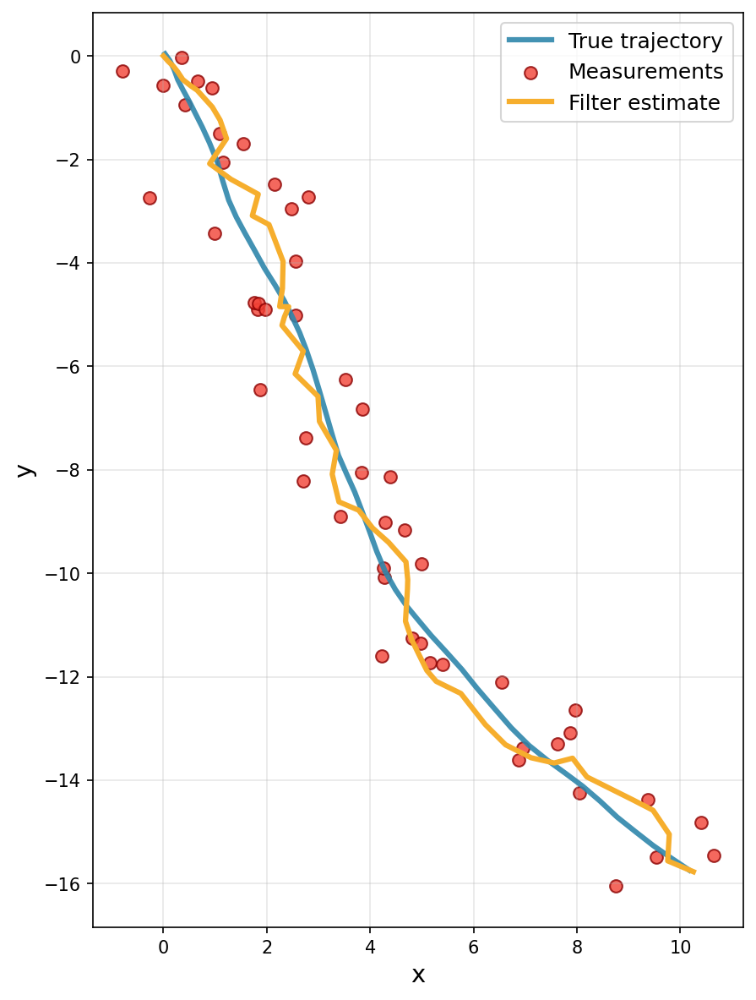

# A simple Kalman filter

Let's implement a Kalman filter with `cuthbert`. We'll use Example 6.8 from [Särkka and Svensson (2023)](https://users.aalto.fi/~ssarkka/pub/bfs_book_2023_online.pdf),
where the goal is to track a car's position and velocity in 2D space at discrete time intervals from noisy measurements of its position.

### Setup and imports

```{.python #kalman-imports}
from jax import random, jit, numpy as jnp
import matplotlib.pyplot as plt

from cuthbert import filter
from cuthbert.gaussian import kalman
```


### Generate sample data

We first simulate the system to generate a sequence of observations. The state vector represents the car's position and velocity: $\textbf{x} = (x, y, \dot{x}, \dot{y})$ where $(x, y)$ is the car's position and $(\dot{x}, \dot{y})$ its velocity.

```{.python #kalman-generate-data}
def generate_car_tracking_data(key, num_steps=50):
    # Model specification follows Example 6.8 from Särkka and Svensson (2023).
    x_dim, y_dim, dt = 4, 2, 0.1

    # Initial state
    m0 = jnp.array([0.0, 0.0, 1.0, -1.0])
    chol_P0 = 0.05 * jnp.eye(x_dim)

    # Dynamics model
    F = jnp.array([[1, 0, dt, 0], [0, 1, 0, dt], [0, 0, 1, 0], [0, 0, 0, 1]])
    q1_squared = 1.0
    q2_squared = 1.0
    Q = jnp.array(
        [
            [q1_squared * dt**3 / 3, 0, q1_squared * dt**2 / 2, 0],
            [0, q2_squared * dt**3 / 3, 0, q2_squared * dt**2 / 2],
            [q1_squared * dt**2 / 2, 0, q1_squared * dt, 0],
            [0, q2_squared * dt**2 / 2, 0, q2_squared * dt],
        ]
    )
    chol_Q = jnp.linalg.cholesky(Q)

    # Observation model
    H = jnp.array([[1, 0, 0, 0], [0, 1, 0, 0]])
    chol_R = 0.5 * jnp.eye(2)

    # Simulate states and observations
    xs, ys = [], []
    key, state_key, obs_key = random.split(key, 3)
    x = m0 + chol_P0 @ random.normal(state_key, (x_dim,))
    y = H @ x + chol_R @ random.normal(obs_key, (y_dim,))
    xs.append(x)
    ys.append(y)

    for t in range(num_steps):
        key, state_key, obs_key = random.split(key, 3)
        x = F @ x + chol_Q @ random.normal(state_key, (x_dim,))
        y = H @ x + chol_R @ random.normal(obs_key, (y_dim,))
        xs.append(x)
        ys.append(y)

    # Duplicate the model parameters across time steps
    Fs = jnp.repeat(F[None], num_steps, axis=0)
    cs = jnp.zeros((num_steps, x_dim))
    chol_Qs = jnp.repeat(chol_Q[None], num_steps, axis=0)

    Hs = jnp.repeat(H[None], num_steps + 1, axis=0)
    ds = jnp.zeros((num_steps + 1, y_dim))
    chol_Rs = jnp.repeat(chol_R[None], num_steps + 1, axis=0)
    ys = jnp.stack(ys)
    true_states = jnp.stack(xs)

    return m0, chol_P0, Fs, cs, chol_Qs, Hs, ds, chol_Rs, ys, true_states

# Generate example data
key = random.key(42)
m0, chol_P0, Fs, cs, chol_Qs, Hs, ds, chol_Rs, ys, true_states = generate_car_tracking_data(key)
```

The state-space model specification for using the Kalman filter in `cuthbert` is as follows:

\begin{align*}
    x_{0} & \sim \mathcal{N}(m_{0}, \mathrm{chol\_P}_{0} \times \mathrm{chol\_P}_{0}^{\top}), \\
    x_{t+1} \mid x_{t} & \sim \mathcal{N}(F_{t} x_{t} + c_{t}, \mathrm{chol\_Q}_{t} \times \mathrm{chol\_Q}_{t}^{\top}), \quad t \in \{0, 1, \ldots, T - 1\}, \\
    y_{t} \mid x_{t} & \sim \mathcal{N}(H_{t} x_{t} + d_{t}, \mathrm{chol\_R}_{t} \times \mathrm{chol\_R}_{t}^{\top}), \quad t \in \{0, 1, \ldots, T\}.
\end{align*}

Note that instead of working with full covariance matrices, we work with their
*square roots* or generalized Cholesky decompositions for improved numerical
stability, denoted by the `chol_` prefix.

### Build the Kalman filter

`cuthbert` uses a functional approach based on **parameter extraction
functions** to build filters. This design pattern allows for flexible handling
of time-varying parameters.

#### The Parameter Extraction Pattern

Instead of passing matrices directly, `kalman.build_filter()` takes three functions that extract the necessary parameters given a time index (or other model inputs):

- **`get_init_params(model_inputs)`**: Returns initial state mean `m0` and noise Cholesky factor `chol_P0`.
- **`get_dynamics_params(model_inputs)`**: Returns dynamics matrix `F`, bias term `c`, and process noise Cholesky factor `chol_Q`.
- **`get_observation_params(model_inputs)`**: Returns observation matrix `H`, bias term `d`, observation noise Cholesky factor `chol_R`, and the actual observation `y`.

This pattern separates the model specification from the filtering algorithm, making the code more modular and allowing the same filter to work with different parameterizations (time-varying, hierarchical, etc.).

??? "Understanding `model_inputs`"
    The `model_inputs` parameter passed to each extraction function can be any
    [pytree](https://docs.jax.dev/en/latest/pytrees.html) that helps identify what parameters to return.
    In the most common case, it's simply a time index, but it could be more complex data like
    hyperparameters or external covariates.

    In our car tracking example, `model_inputs` is just an array of time indices (0, 1, 2, ..., T),
    allowing each function to select the appropriate matrices for that time step. The filtering
    algorithm passes each element of the `model_inputs` array to the extraction functions in sequence.

**Important indexing note**: The `get_dynamics_params` function uses `model_inputs - 1` because dynamics describe transitions from time $t-1$ to $t$, while `get_observation_params` uses `model_inputs` directly since observations occur at each time step.

```{.python #kalman-build-filter}
def build_car_tracking_filter(m0, chol_P0, Fs, cs, chol_Qs, Hs, ds, chol_Rs, ys):

    def get_init_params(model_inputs):
        return m0, chol_P0

    def get_dynamics_params(model_inputs):
        t = model_inputs - 1
        return Fs[t], cs[t], chol_Qs[t]

    def get_observation_params(model_inputs):
        t = model_inputs
        return Hs[t], ds[t], chol_Rs[t], ys[t]

    filter_obj = kalman.build_filter(
        get_init_params, get_dynamics_params, get_observation_params
    )
    model_inputs = jnp.arange(len(ys))
    return filter_obj, model_inputs

filter_obj, model_inputs = build_car_tracking_filter(
    m0, chol_P0, Fs, cs, chol_Qs, Hs, ds, chol_Rs, ys
)
```

### Run the Kalman filter

With the filter built, running the Kalman filter is now as simple as calling the `cuthbert.filter`
function with our constructed filter object and model inputs:

```{.python #kalman-run-filter}
# Run the filter
filtered_states = filter(filter_obj, model_inputs, parallel=True)

# Extract results
means = filtered_states.mean  # Posterior state means
chol_covs = filtered_states.chol_cov  # Cholesky factors of posterior covariances
log_normalizing_constant = filtered_states.log_normalizing_constant  # Log marginal likelihoods
```

!!! tip "Temporal parallelization of the filter"
    The `parallel=True` option enables [temporal parallelization](https://ieeexplore.ieee.org/document/9013038)
    of the filter, which can significantly speed up computation for longer time
    series if a hardware accelerator (GPU or TPU) is available (from
    $\mathcal{O}(T)$ for the sequential filter to $\mathcal{O}(\log T)$ for the
    parallel filter). Our implementation is based on [Yaghoobi et al. (2025)](https://epubs-siam-org.libproxy.aalto.fi/doi/10.1137/23M156121X).

!!! tip "Just-in-time (JIT) compilation for repeated use"
    If you need to run the filter multiple times (e.g., during parameter optimization), you can
    JIT-compile it for better performance with
    [`jax.jit`](https://docs.jax.dev/en/latest/_autosummary/jax.jit.html). All functions in `cuthbert` are
    pure and designed to work seamlessly with JAX function transformations.

    ```{.python #kalman-jit-example}
    jitted_filter = jit(filter, static_argnames=['filter_obj', 'parallel'])
    filtered_states = jitted_filter(filter_obj, model_inputs, parallel=True)
    ```

### Visualize the results

Now let's visualize how well our Kalman filter tracked the car's movement. The
plot shows three key elements: the true trajectory (unknown in real
applications), the noisy GPS measurements, and the filtered estimates of the
car's position.

??? "Code to plot the results."
    ```{.python #kalman-plot}
    true_pos = true_states[:, :2]
    filtered_pos = means[:, :2]

    plt.figure(figsize=(10, 8))
    plt.plot(true_pos[:, 0], true_pos[:, 1], '-', color='#2E86AB', linewidth=3,
            label='True trajectory', alpha=0.9)
    plt.scatter(ys[:, 0], ys[:, 1], c='#F24236', edgecolors='darkred',
            s=50, alpha=0.8, label='Measurements')
    plt.plot(filtered_pos[:, 0], filtered_pos[:, 1], '-', color='#F6AE2D', linewidth=3,
            label='Filter estimate')

    plt.xlabel("x", fontsize=14)
    plt.ylabel("y", fontsize=14)
    plt.legend(fontsize=12, loc='upper right')
    plt.grid(True, alpha=0.3)
    plt.gca().set_aspect('equal', adjustable='box')
    plt.tight_layout()
    # plt.show()
    plt.close()
    ```



??? tip "Bonus: Handle missing observations"
    `cuthbert` automatically handles missing data when observations contain NaN values:

    ```{.python #kalman-bonus-missing}
    # Create data with missing observations (simulate GPS outage)
    ys_missing = ys.at[20:30, :].set(jnp.nan)  # Missing position observations during turn

    # Rebuild filter with missing data
    filter_obj_missing, model_inputs_missing = build_car_tracking_filter(
        m0, chol_P0, Fs, cs, chol_Qs, Hs, ds, chol_Rs, ys_missing
    )

    # Run filtering - cuthbert handles NaNs automatically
    filtered_states_missing = filter(filter_obj_missing, model_inputs_missing)

    print("Successfully handled missing observations!")
    print("Missing observation period: steps 20-30 during the car's turn")
    print("Filter uncertainty automatically increased during GPS outage")
    ```

## Key Takeaways

- **Parameter extraction pattern**: `cuthbert` uses a functional approach where
  filters are built from parameter extraction functions, allowing flexible handling
  of time-varying parameters and clean separation of model specification from
  algorithm implementation.
- **Cholesky-based filtering**: `cuthbert` works with Cholesky factors of covariance
  matrices for improved numerical stability, avoiding direct covariance matrix
  operations.
- **Temporal parallelization**: The `parallel=True` option enables parallel-in-time
  filtering, reducing complexity from $\mathcal{O}(T)$ to $\mathcal{O}(\log T)$ on
  accelerators.
- **Automatic missing data handling**: `cuthbert` automatically handles missing
  observations (NaN values) without special configuration.
- **JAX integration**: All `cuthbert` functions are pure and compatible with JAX
  transformations like `jit`, `vmap`, and automatic differentiation.

## Next Steps

- **Smoothing**: Use [`cuthbert.smoother`](../cuthbert_api/smoothing.md) for
  backward pass smoothing.
- **Parameter Learning**: Combine with optimization libraries like
  [`optax`](https://github.com/google-deepmind/optax). Check out the [parameter
  estimation example](parameter_estimation_em.md) for more details.
- **Sequential Monte Carlo**: Explore nonlinear and non-Gaussian filtering with
  `cuthbert.smc`, check out the example on [online particle filtering and
  prediction for a stochastic volatility model](online_stoch_vol.md).
- **Advanced Models**: Check out an extended Kalman filter for a nonlinear
  state-space model [inferring latent football team skill
  ratings](../quickstart.md).


<!--- entangled-tangle-block
```{.python file=examples_scripts/kalman_tracking.py}
<<kalman-imports>>
<<kalman-generate-data>>
<<kalman-build-filter>>
<<kalman-run-filter>>
<<kalman-jit-example>>
<<kalman-plot>>
<<kalman-bonus-missing>>
```
-->