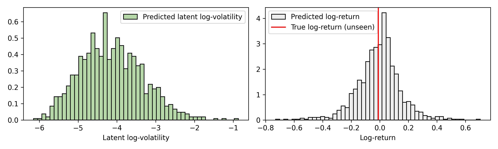
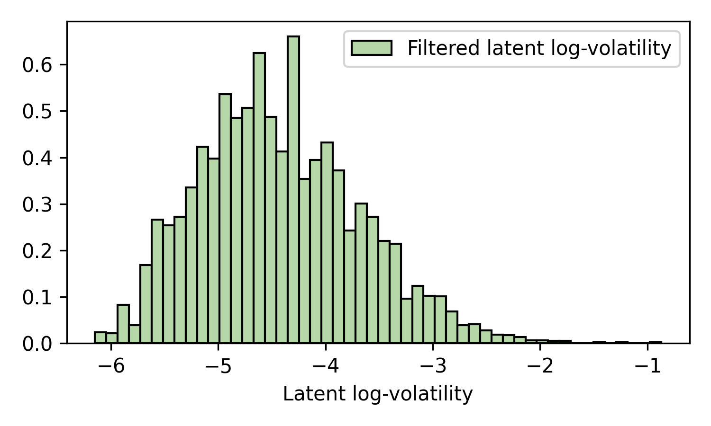

# Online Filtering and Prediction

A key feature of inference in state-space models is that estimates can be updated
online as new data arrives. In this example, we'll use `cuthbert` to infer the
volatility of the Marks & Spencer stock price data and then use it to predict
a future volatility and stock price before updating the approximation with new data.

The model we'll use is a simple stochastic volatility model adapted from section 2.4.3
in [Chopin and Papaspiliopoulos (2023)](https://doi.org/10.1007/978-3-030-47845-2).

Of additional interest, we'll define the state-space model dynamics in continuous-time
so that we easily handle the irregular observation times (which occur here as stock
prices aren't available on weekends). We'll also define the observation model in a
convenient way to handle missing data and predict future values using the same
filtering framework.

## Setup and imports

```{.python #online-stoch-vol-setup}
from typing import NamedTuple
import matplotlib.pyplot as plt
import pandas as pd
from jax import Array, random, numpy as jnp, tree, nn
from jax.scipy.stats import norm
import numpy as np
import yfinance as yf

from cuthbert import filter
from cuthbert.smc import particle_filter
from cuthbertlib.resampling import systematic
```

We'll use a simple bootstrap particle filter for inference since our model is
non-linear, non-Gaussian and low-dimensional (so we don't need to worry about the
particle filter curse of dimensionality).

## Load data

We can use the [`yfinance`](https://github.com/ranaroussi/yfinance) library to easily
download the Marks & Spencer stock price data for the past 3 years.

??? quote "Code to download Marks & Spencer stock price data"
    ```{.python #online-stoch-vol-load-data-func}
    def download_stock_data(
        ticker: str, start_date: str | None = None, end_date: str | None = None
    ) -> pd.DataFrame:
        if end_date is None:
            end_date = pd.Timestamp.today().strftime("%Y-%m-%d")

        if start_date is None:
            # end_date - 3 years
            start_date = str(pd.Timestamp(end_date) - pd.Timedelta(days=365 * 3))[:10]

        stock = yf.Ticker(ticker)
        data = stock.history(start=start_date, end=end_date)

        # Calculate log returns
        data["log_return"] = np.log(data["Close"] / data["Close"].shift(1))

        # Remove first row (NaN log return)
        data = data.iloc[1:].reset_index()

        # Convert dates to days since first observation
        origin_date = data["Date"].iloc[0]
        data["days_since_origin"] = (data["Date"] - origin_date).dt.days

        return data
    ```

```{.python #online-stoch-vol-load-data}
data = download_stock_data(ticker="MKS.L")

print(data.tail())
```


## Model inputs for `cuthbert`

We'll now extract the data we require for inference, this will be the current and
previous timestamps (we'll just use daily frequency data here) as well as the log
return of the stock price.

The data will be stored as `jax` arrays in a convenient `NamedTuple`.

```{.python #online-stoch-vol-model-inputs}
# Create model inputs
class ObservationData(NamedTuple):
    time: Array  # Current observation time (days since origin)
    time_prev: Array  # Previous observation time (days since origin)
    log_return: Array  # Log return Y_t = log(price_t / price_{t-1})


times = jnp.array(data["days_since_origin"].values)
log_returns = jnp.array(data["log_return"].values)
times_prev = jnp.concatenate([jnp.array([0]), times[:-1]])

obs_data = ObservationData(
    time=times,
    time_prev=times_prev,
    log_return=log_returns,
)

previous_data = tree.map(lambda x: x[:-1], obs_data)
new_data = tree.map(lambda x: x[-1], obs_data)
```

We've also (synthetically) split the data into previous and new data to mimic an
online inference setting.

## Stochastic volatility model

The model we'll use is a simple stochastic volatility model from section 2.4.3
in [Chopin and Papaspiliopoulos (2023)](https://doi.org/10.1007/978-3-030-47845-2)
but adapt the dynamics to be defined in continuous-time so that we can handle
irregular observation times.

$$
\begin{aligned}
    p(x_0) & = \mathrm{N}(x_0 \mid \mu, \sigma^2), \\
    dx_t &= - \theta (x_t - \mu) dt + \sigma dW_t, \\
    p(y_t | x_t) & = \mathrm{N}(y_t\mid 0, \exp(x_t)),
\end{aligned}
$$

The continuous-time dynamics represent an [Ornstein-Uhlenbeck process](https://en.wikipedia.org/wiki/Ornstein%E2%80%93Uhlenbeck_process), which is a mean-reverting stochastic process.
It can be solved exactly giving

$$
\begin{aligned}
    p(x_{t +\delta_t} \mid x_t) &= \mathrm{N}(x_t \mid \mu(\delta_t), \sigma(\delta_t)^2),\\
    \mu(\delta_t) &= \mu + (x_t - \mu) e^{-\theta \delta_t}, \\
    \sigma(\delta_t)^2 &= \sigma^2 \frac{1 - e^{-2 \theta \delta_t}}{2 \theta}. \\
\end{aligned}
$$

We'll set the hyperparameters of the model without thinking too much, in practice you'd
probably want to learn these from the data too!

```{.python #online-stoch-vol-model-params}
mu = 0.0  # Mean log-volatility (to revert to)
theta = -jnp.log(0.95)  # Persistence (close to 1 for volatility clustering)
sigma = 0.3  # Volatility of volatility
init_mean = 0.0  # Initial mean
init_std = 1.0  # Initial stds
```

Then we'll convert our mathematical model into one that `cuthbert.smc.particle_filter`
can understand.

```{.python #online-stoch-vol-model-func}
def init_sample(key: Array, model_inputs: ObservationData) -> Array:
    return init_mean + init_std * random.normal(key, ())


def propagate_sample(key: Array, state: Array, model_inputs: ObservationData) -> Array:
    dt = model_inputs.time - model_inputs.time_prev
    mean = mu + (state - mu) * jnp.exp(-theta * dt)
    var = (sigma**2) * (1 - jnp.exp(-2 * theta * dt)) / (2 * theta)
    std = jnp.sqrt(var)
    return mean + std * random.normal(key, ())


def log_potential(
    state_prev: Array, state: Array, model_inputs: ObservationData
) -> Array:
    # Check if observation is missing (NaN)
    is_missing = jnp.isnan(model_inputs.log_return)

    # Log likelihood: log p(Y_t | X_t) = log N(Y_t; 0, exp(X_t))
    log_vol = state
    vol = jnp.exp(0.5 * log_vol)  # exp(X_t/2) = sqrt(exp(X_t))
    log_pot = norm.logpdf(model_inputs.log_return, 0.0, vol)

    # Missing observation = uniform potential => filter just propagates
    return jnp.where(is_missing, 0.0, log_pot)
```

It's important to note here how we've handled `nan` values in the log-return data.
When we encounter a `nan` value, we set the log-potential to 0 which means tell the
particle filter there is no information in the likelihood for that time step. This
allows us to do prediction as filtering with missing data.


## Setup the particle filter

Now we'll get `cuthbert` involved! We'll choose a number of particles and a threshold
on how often to resample before constructing the filter object.

```{.python #online-stoch-vol-particle-filter-setup}
n_particles = 1000
ess_threshold = 0.5

pf = particle_filter.build_filter(
    init_sample=init_sample,
    propagate_sample=propagate_sample,
    log_potential=log_potential,
    n_filter_particles=n_particles,
    resampling_fn=systematic.resampling,
    ess_threshold=ess_threshold,
)
```

We'll then use the `cuthbert.filter` offline filtering function to run on the previous
data.

```{.python #online-stoch-vol-particle-filter-run-previous}
key, previous_key = random.split(random.key(0))
previous_states = filter(pf, previous_data, key=key)
filter_state = tree.map(lambda x: x[-1], previous_states)
```

The last line simply extracts the final temporal state. Now we are mimicking an online
inference setting where we have a previous filter state and we want to predict the
next time point.

## Online prediction

We'll now propagate the approximation forward to the next time point and
probabilistically predict the log-volatility and log-return.

```{.python #online-stoch-vol-particle-filter-predict}
predict_model_inputs = ObservationData(
    time=new_data.time,
    time_prev=new_data.time_prev,
    log_return=jnp.array(jnp.nan),  # nan indicates missing observation, so filter->predict
)
key, predict_key, predict_ys_key = random.split(key, 3)
predict_state = pf.filter_combine(
    filter_state, pf.filter_prepare(predict_model_inputs, key=predict_key)
)
predict_weights = jnp.exp(
    predict_state.log_weights - nn.logsumexp(predict_state.log_weights)
)
predict_ys = jnp.exp(predict_state.particles / 2) * random.normal(
    predict_ys_key, (n_particles,)
)
```

Now we'll plot the distributions over our predicted values.

??? quote "Code to plot the predicted distributions."
    ```{.python #online-stoch-vol-particle-filter-predict-plot}
    fig, axs = plt.subplots(1, 2, figsize=(10, 3))
    axs[0].hist(
        predict_state.particles,
        bins=50,
        density=True,
        weights=predict_weights,
        label="Predicted latent log-volatility",
        color="#b6d7a8",
        edgecolor="black",
    )
    axs[0].set_xlabel("Latent log-volatility")
    axs[0].legend()
    axs[1].hist(
        predict_ys,
        bins=50,
        density=True,
        weights=predict_weights,
        label="Predicted log-return",
        color="#eeeeee",
        edgecolor="black",
    )
    axs[1].axvline(new_data.log_return, color="red", label="True log-return (unseen)")
    axs[1].set_xlabel("Log-return")
    axs[1].legend()
    fig.tight_layout()
    fig.savefig("docs/assets/online_stoch_vol_predict.png", dpi=300)
    ```



We've also highlighted for reference the true log-return (which is unseen) in red, which
the particle filter has not seen (yet).

## Online filtering

Now we'll update the approximation with the new data.

```{.python #online-stoch-vol-particle-filter-filter}
key, filter_key = random.split(key)
new_filter_state = pf.filter_combine(
    filter_state, pf.filter_prepare(new_data, key=filter_key)
)
new_filter_weights = jnp.exp(
    new_filter_state.log_weights - nn.logsumexp(new_filter_state.log_weights)
)
```
This time the filter sees the actual log-return rather than `jnp.nan`.

??? quote "Code to plot the filtered distribution."
    ```{.python #online-stoch-vol-particle-filter-filter-plot}
    fig, ax = plt.subplots(figsize=(5, 3))
    ax.hist(
        new_filter_state.particles,
        bins=50,
        density=True,
        weights=new_filter_weights,
        label="Filtered latent log-volatility",
        color="#b6d7a8",
        edgecolor="black",
    )
    ax.set_xlabel("Latent log-volatility")
    ax.legend()
    fig.tight_layout()
    fig.savefig("docs/assets/online_stoch_vol_filter.png", dpi=300)
    ```




## Key Takeaways

- We can use `cuthbert` to perform online filtering and prediction in a state-space model.
- We can handle irregular observation times by defining the model dynamics in continuous-time.
- We can handle missing data in the observation model by setting the log-potential to 0.
- Missing data also allows us to do prediction within the same filtering framework.

## Next Steps

- **Smoothing**: Use [`cuthbert.smoother`](../cuthbert_api/smoothing.md) to
  perform backward smoothing for more accurate historical state estimates.
- **Parameter learning**: Learn the hyperparameters from the data using gradient
  descent, expectation maximization (see the [parameter estimation
  example](parameter_estimation_em.md)), or Bayesian sampling.
- **More examples**: Explore other [examples](index.md) including [Kalman
  filtering](kalman_tracking.md) and [temporal
  parallelization](temporal_parallelization_kalman.md).


<!--- entangled-tangle-block
```{.python file=examples_scripts/online_stoch_vol.py}
<<online-stoch-vol-setup>>
<<online-stoch-vol-load-data-func>>
<<online-stoch-vol-load-data>>
<<online-stoch-vol-model-inputs>>
<<online-stoch-vol-model-params>>
<<online-stoch-vol-model-func>>
<<online-stoch-vol-particle-filter-setup>>
<<online-stoch-vol-particle-filter-run-previous>>
<<online-stoch-vol-particle-filter-predict>>
<<online-stoch-vol-particle-filter-predict-plot>>
<<online-stoch-vol-particle-filter-filter>>
<<online-stoch-vol-particle-filter-filter-plot>>
```
-->