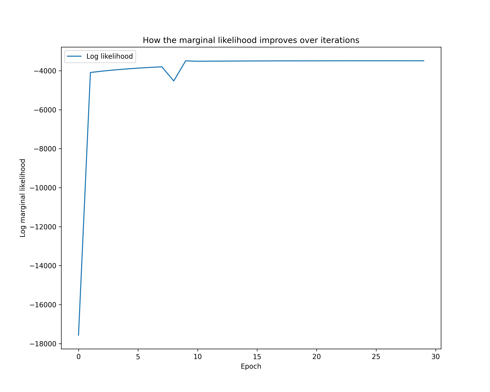
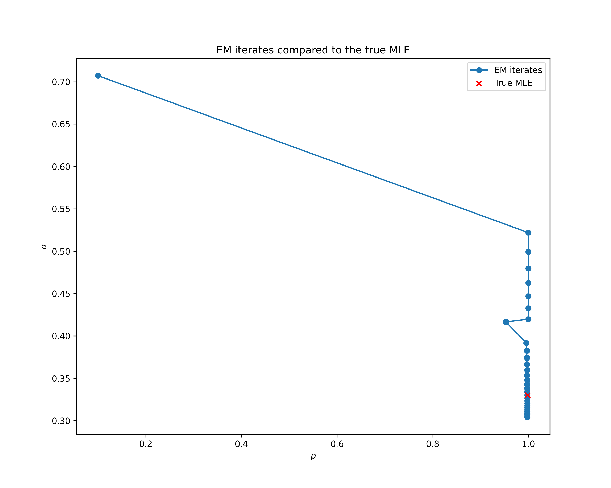

# Parameter Estimation with Expectation Maximization

This is a tutorial on using `cuthbert` to perform parameter estimation in state-space models
with the expectation-maximization (EM) algorithm ([Dempster et al. (1977)](https://www.jstor.org/stable/2984875)).

We use the example from experiment 14.6 in [Chopin and Papaspiliopoulos
(2020)](https://link.springer.com/book/10.1007/978-3-030-47845-2), which
is originally from [Temereanca et al. (2008)](https://doi.org/10.1523/JNEUROSCI.1586-08.2008).
The state-space model is defined as follows:

$$
\begin{align}
    X_0 & \sim N(0, \sigma^2), \\
    X_t & = \rho X_{t-1} + \sigma \xi_t, \qquad \xi_t \sim N(0, 1), \\
    Y_t & \sim \text{Binomial}(50, \textrm{logit\_inv}(X_t)), \\
\end{align}
$$

where $\textrm{logit\_inv}(x) = 1/(1 + e^{-x})$. The unknown static parameters are
$(\rho, \sigma^{2}) \eqqcolon \theta$, where $0 \leq \rho \leq 1$ and $\sigma \geq 0$.

Given an observation
sequence $y_{1:T}$, our goal is to find the maximum likelihood estimate (MLE)

$$
\theta_{\text{MLE}} = \text{arg max}_{\theta} \, p_{\theta}(y_{1:T}) = \text{arg max}_{\theta} \, \int p_{\theta}(x_{0:T}, y_{1:T}) \, \mathrm{d} x_{0:T}.
$$

## Crash course on EM

The EM algorithm is used to find the MLE when the marginal likelihood
$p_{\theta}(y_{1:T})$ is intractable. EM maximizes a lower bound on the log
marginal likelihood known as the _evidence lower bound_ (ELBO):

$$
\begin{equation}
Q(\theta; q) \coloneqq \int \log \frac{p_{\theta}(x_{0:T}, y_{1:T})}{q(x_{0:T})}
  \, q(x_{0:T}) \, \mathrm{d} x_{0:T},
\end{equation}
$$

where $q$ is an arbitrary probability distribution. The maximization is performed in two
steps. In the _E-step_, we maximize $Q(\theta, q)$ with respect to $q$, and the maximizer
is known analytically to be the smoothing distribution
$q^{\star} \coloneqq p_{\theta}(x_{0:T} \mid y_{1:T})$ (i.e. the posterior).
Then, in the _M-step_, we maximize $Q(\theta, q^{\star})$ with respect to
$\theta$, and the maximizer is our current best guess of the MLE. This process
is iterated until convergence.

For more details on the use of EM for parameter estimation in state-space models, see
section 14 in [Chopin and Papaspiliopoulos
(2020)](https://link.springer.com/book/10.1007/978-3-030-47845-2) or section 12 in
[Särkkä (2013)](https://users.aalto.fi/~ssarkka/pub/cup_book_online_20131111.pdf).

## Imports and data loading

We start by importing all the necessary modules, along with the experiment
data from [Temereanca et al. (2008)](https://doi.org/10.1523/JNEUROSCI.1586-08.2008)
hosted in the [`particles`](https://github.com/nchopin/particles/)
GitHub repository.

```{.python #em-imports}
from typing import NamedTuple

import jax.numpy as jnp
import matplotlib.pyplot as plt
from jax import Array, tree, vmap
from jax.scipy.optimize import minimize
from jax.scipy.stats import binom, norm
from pandas import read_csv

from cuthbert import filter, smoother
from cuthbert.gaussian import moments
from cuthbert.gaussian.kalman import KalmanSmootherState
from cuthbertlib.quadrature.gauss_hermite import weights

# Load observation data
csv_url = "https://raw.githubusercontent.com/nchopin/particles/refs/heads/master/particles/datasets/thaldata.csv"
data = read_csv(csv_url, header=None).to_numpy()[0]
data = jnp.array(data)
# Add dummy value for initial time step (cuthbert convention is no initial observation)
data = jnp.concatenate([jnp.array([jnp.nan]), data])[..., None]
```
Here we've added a `nan` at the start of the data to represent there being no
observation at time $t=0$. By setting the observation to `nan`, `cuthbert` will
know to treat this observation as missing.

## Parameter specification

We then define a named tuple to hold the parameters, along with functions to
convert between constrained and unconstrained formulations of $\rho \in [0, 1]$ and
$\sigma \in [0, \infty)$. Being able to constrain and unconstrain will be useful for
when we perform the M-step optimization numerically where we always want to be working
with unconstrained parameters in $[-\infty, \infty]$. For more information on
constraint transforms for inference, see the [Stan reference manual](https://mc-stan.org/docs/reference-manual/transforms.html).

```{.python #em-utils}
class Params(NamedTuple):
    rho: Array
    sigma: Array


def logit(p: Array) -> Array:
    # Converts [0, 1] to [-inf, inf]
    return jnp.log(p / (1 - p))


def logit_inv(x: Array) -> Array:
    # Converts [-inf, inf] to [0, 1]
    return 1 / (1 + jnp.exp(-x))


def constrain_params(params: Array) -> Params:
    return Params(
        rho=logit_inv(params[0]).reshape(1),
        sigma=jnp.exp(params[1]).reshape(1, 1),
    )


def unconstrain_params(params: Params) -> Array:
    return jnp.array([logit(params.rho.squeeze()), jnp.log(params.sigma.squeeze())])
```
Note that the unconstrained parameters are also converted to an array rather than
named tuple. This is purely due to the limitations of the
[`jax.scipy.optimize.minimize`](https://docs.jax.dev/en/latest/_autosummary/jax.scipy.optimize.minimize.html)
function we will use that requires array input. If we instead used
[`optax`](https://github.com/google-deepmind/optax) or another optimizer library, we
could use a named tuple instead.

## Model definition

Since the SSM in (1)-(3) is nonlinear, the true posterior $p_{\theta}(x_{0:T}
\mid y_{1:T})$ is not tractable, and so must be approximated for the E-step.
We will use one of the Gaussian-approximated filters and smoothers
provided in `cuthbert`, in particular the moment-based extended Kalman filter
from [`cuthbert.gaussian.moments`](../cuthbert_api/gaussian/moments.md).
Let's build the filter and smoother objects below that correspond to the SSM:

```{.python #em-model}
# Build model objects - this is where the model definition is encapsulated
def model_factory(params: Params):
    def get_init_params(model_inputs: int) -> tuple[Array, Array]:
        return jnp.array([0.0]), params.sigma

    def get_dynamics_moments(state, model_inputs: int):
        def dynamics_mean_and_chol_cov_func(x):
            mean_t = jnp.where(model_inputs == 0, x, params.rho * x)
            sd_t = jnp.where(model_inputs == 0, jnp.zeros_like(x), params.sigma)
            return mean_t, sd_t

        return dynamics_mean_and_chol_cov_func, state.mean

    def get_observation_moments(state, model_inputs: int):
        def observation_mean_and_chol_cov_func(x):
            # Binomial parameters
            n = 50
            p = logit_inv(x)
            mean = n * p
            var = n * p * (1 - p)
            sd = jnp.sqrt(var)
            return mean, sd

        return (
            observation_mean_and_chol_cov_func,
            state.mean,
            data[model_inputs],
        )

    filter_obj = moments.build_filter(
        get_init_params,
        get_dynamics_moments,
        get_observation_moments,
        associative=False,
    )
    smoother_obj = moments.build_smoother(
        get_dynamics_moments, store_gain=True, store_chol_cov_given_next=True
    )

    return filter_obj, smoother_obj


# Define model inputs
T = len(data)
model_inputs = jnp.arange(T)
```
Note that for the smoother we had to specify that we want to store the smoothing
`gain` and `chol_cov_given_next` matrices in the smoother state. We'll need these later
to compute integrals with respect to the joint smoothing distributions
$p(x_{t-1}, x_t | y_{1:T})$ (by default `cuthbert.gaussian.moments` calculates them
but doesn't store them).


## Numerial integration for the M-step

Now that we have a way to approximately solve the E-step (i.e. compute the
smoothing distribution), we need to compute
$Q(\theta; q^{\star})$ for the M-step. However, the integral in (4) is
intractable, and hence must also be approximated. Conveniently, since we're
using a Gaussian approximation for the posterior, we can use one of the
Gaussian quadrature methods provided in [`cuthbertlib.quadrature`](../cuthbertlib_api/quadrature.md)
to estimate the integral. Here we use the [Gauss-Hermite
quadrature](https://en.wikipedia.org/wiki/Gauss%E2%80%93Hermite_quadrature)
method, available in `cuthbertlib.quadrature.gauss_hermite`.
Note that since the optimizer we'll be using expects a loss function to **minimize**,
we'll define the loss as the negative ELBO $-Q(\theta, q^{\star})$. We'll also ignore
the $\log q(x_{0:T})$ term inside the integral for the purposes of optimization since it
doesn't depend on $\theta$.

```{.python #em-loss-fn}
# Define loss function for M-step as -Q
# Use Gauss-Hermite quadrature to approximate the expectation
gauss_hermite_order = 10
quadrature_1d = weights(1, order=gauss_hermite_order)
quadrature_2d = weights(2, order=gauss_hermite_order)


def loss_fn(unconstrained_params: Array, ys: Array, smooth_dist: KalmanSmootherState):
    params = constrain_params(unconstrained_params)

    def loss_initial(m, chol_cov):
        # E_{p(x_0 | m, chol_cov)} [log N(x_0 | 0, params.sigma^2)]
        sigma_points = quadrature_1d.get_sigma_points(m, chol_cov)
        # points.shape=wm.shape=wc.shape=(gauss_hermite_order, 1)
        return jnp.dot(
            sigma_points.wm,
            norm.logpdf(
                sigma_points.points,
                0.0,
                params.sigma,
            ),
        )

    def loss_dynamics(m_joint, chol_cov_joint):
        # E_{p(x_{t-1}, x_t | m_joint, chol_cov_joint)} [log N(x_t | rho * x_{t-1}, params.sigma^2)]
        sigma_points = quadrature_2d.get_sigma_points(m_joint, chol_cov_joint)
        # points.shape=wm.shape=wc.shape=(gauss_hermite_order, 2)
        return jnp.dot(
            sigma_points.wm,
            norm.logpdf(
                sigma_points.points[:, 0],
                sigma_points.points[:, 1] * params.rho,
                params.sigma.squeeze(),
            ),
        )

    def loss_observation(m, chol_cov, y):
        # E_{x_t | m, chol_cov)} [log Bin(y_t | 50, logit_inv(x_t))]
        sigma_points = quadrature_1d.get_sigma_points(m, chol_cov)
        return jnp.dot(
            sigma_points.wm,
            binom.logpmf(y, 50, logit_inv(sigma_points.points)),
        )

    joint_means = jnp.concatenate([smooth_dist.mean[:-1], smooth_dist.mean[1:]], axis=1)

    def construct_joint_chol_cov(chol_cov_t_plus_1, gain_t, chol_cov_t_given_t_plus_1):
        return jnp.block(
            [
                [chol_cov_t_plus_1, jnp.zeros_like(chol_cov_t_plus_1)],
                [gain_t @ chol_cov_t_plus_1, chol_cov_t_given_t_plus_1],
            ]
        )

    joint_chol_covs = vmap(construct_joint_chol_cov)(
        smooth_dist.chol_cov[1:],
        smooth_dist.gain[:-1],
        smooth_dist.chol_cov_given_next[:-1],
    )

    total_loss = (
        loss_initial(smooth_dist.mean[0], smooth_dist.chol_cov[0]).squeeze()
        + vmap(loss_dynamics)(joint_means, joint_chol_covs).sum()
        + vmap(loss_observation)(
            smooth_dist.mean[1:], smooth_dist.chol_cov[1:], ys[1:]
        ).sum()
    )
    return -total_loss
```

## Run EM

We now have all the building blocks necessary to perform EM. All that is left
is to put the E and M-steps into a loop. In the code block below, we use the
[BFGS algorithm](https://en.wikipedia.org/wiki/Broyden%E2%80%93Fletcher%E2%80%93Goldfarb%E2%80%93Shanno_algorithm)
provided by `jax.scipy.optimize.minimize` for the M-step for simplicity (the
[`optax`](https://github.com/google-deepmind/optax) library provides several
other optimizers which you might want to use in practice).

```{.python #em-run-em}
# Initialize parameters
rho_init = 0.1
sig_init = 0.5**0.5
params = Params(rho=jnp.array([rho_init]), sigma=jnp.array([[sig_init]]))
params_track = tree.map(lambda x: x[None], params)
log_marginal_likelihood_track = []
n_epochs = 30

for epoch in range(n_epochs):
    filter_obj, smoother_obj = model_factory(params)
    filtered_states = filter(filter_obj, model_inputs)
    log_marginal_likelihood_track.append(filtered_states.log_normalizing_constant[-1])
    smoother_states = smoother(smoother_obj, filtered_states)

    optim_result = minimize(
        loss_fn,
        unconstrain_params(params),
        args=(data, smoother_states),
        method="BFGS",
    )
    params = constrain_params(optim_result.x)
    params_track = tree.map(
        lambda x, y: jnp.concatenate([x, y[None]], axis=0), params_track, params
    )
    print(f"Epoch {epoch + 1}/{n_epochs}: log marginal likelihood = {log_marginal_likelihood_track[-1]}")
```

All done! We can now visualize the learning curve with some plots.

??? "Code to plot the results."
    ```{.python #em-plots}
    # Plot log likelihood
    plt.figure(figsize=(10, 8))
    plt.plot(log_marginal_likelihood_track, label="Log likelihood")
    plt.xlabel("Epoch")
    plt.ylabel("Log likelihood")
    plt.legend()
    plt.title("How the marginal likelihood improves over iterations")
    plt.savefig("docs/assets/em_log_likelihood.png", dpi=300)

    # Plot parameters
    true_mle = (0.9981, 0.1089**0.5)
    plt.figure(figsize=(10, 8))
    plt.plot(
        params_track.rho.squeeze(),
        params_track.sigma.squeeze(),
        marker="o",
        linestyle="-",
        label="EM",
        zorder=0,
    )
    plt.scatter(
        true_mle[0], true_mle[1], color="red", marker="x", label="True MLE", zorder=1, s=100
    )
    plt.xlabel("rho")
    plt.ylabel("sigma")
    plt.legend()
    plt.title("EM iterates compared to the true MLE")
    plt.savefig("docs/assets/em_parameters.png", dpi=300)
    ```





We know the true MLE in this example (marked in red in the above figure). Note
that EM converges to the vicinity of the true value but not exactly, because
both our E and M-steps are approximated. Both these approximations can be
improved, say by replacing the Gaussian-approximated filter and smoother with
asymptotically unbiased particle approximations (see
[`cuthbert.smc`](../cuthbert_api/smc/index.md)), or by
increasing the order of the Gauss-Hermite quadrature.

## Key Takeaways

- **EM algorithm integration**: `cuthbert`'s filtering and smoothing capabilities
  integrate seamlessly with the EM algorithm for parameter estimation in
  state-space models.
- **Gaussian approximation**: The moment-based extended Kalman filter provides
  an efficient Gaussian approximation to the intractable posterior, enabling
  tractable E-steps.
- **Quadrature for M-step**: Gaussian quadrature methods from
  `cuthbertlib.quadrature` enable efficient approximation of the M-step
  integrals when using Gaussian approximations.
- **Flexible parameter constraints**: The constraint/unconstraint pattern allows
  optimization in unconstrained space while maintaining parameter bounds (e.g.,
  $\rho \in [0,1]$, $\sigma \geq 0$).
- **Approximate inference**: Both E and M-steps use approximations, but the
  approximations can be improved by using particle filters/smoothers or
  higher-order quadrature.

## Next Steps

- **Particle-based EM**: Replace the Gaussian approximation with particle filters
  and smoothers from [`cuthbert.smc`](../cuthbert_api/smc/index.md) for
  asymptotically unbiased parameter estimates.
- **Other optimization methods**: Explore gradient-based optimization with
  [`optax`](https://github.com/google-deepmind/optax) for the M-step, or use
  stochastic gradient EM for large datasets.
- **More examples**: Check out other [examples](index.md) including [online
  particle filtering](online_stoch_vol.md) and [Kalman
  tracking](kalman_tracking.md).

<!--- entangled-tangle-block
```{.python file=examples_scripts/parameter_estimation_em.py}
<<em-imports>>
<<em-utils>>
<<em-model>>
<<em-loss-fn>>
<<em-run-em>>
<<em-plots>>
```
-->
