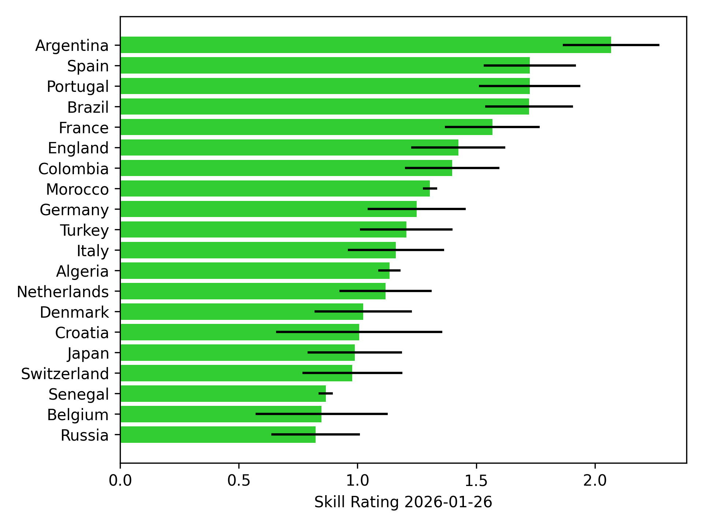
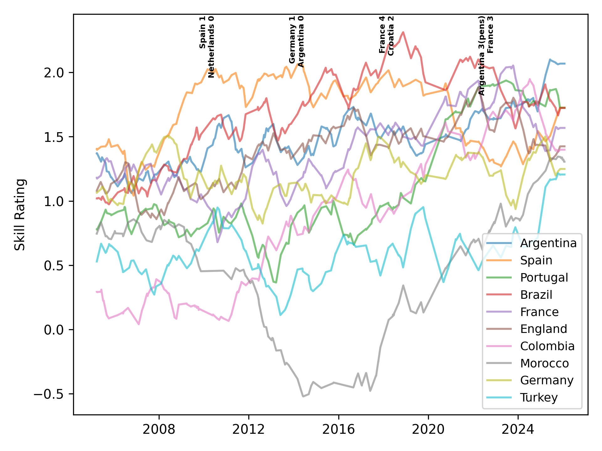

# Quick start

This guide will get you up and running with `cuthbert` for state-space model inference.
We'll walk through an example of ranking international football teams over
time using a linearized Kalman filter.

## Imports

```{.python #quickstart-imports}
from typing import NamedTuple

import matplotlib.pyplot as plt
import pandas as pd
from jax import Array, vmap
from jax import numpy as jnp
from jax.nn import sigmoid
from jax.scipy.stats import norm

from cuthbert import filter, smoother
from cuthbert.gaussian import taylor
from cuthbertlib.types import LogConditionalDensity, LogDensity
```

Nothing too surprising there I hope. We'll be using the [`taylor`](cuthbert_api/gaussian/taylor.md)
module which will let us generate Gaussian approximations to the filtering and smoothing
distributions whilst handling the discrete nature of the observations.


## Load data

We're going to need historical data from international football matches including
the dates of the matches, which teams played, and the result (draw, home win, away win).
Luckily, there's a very handy dataset of international football match results available on GitHub:
[github.com/martj42/international_results](https://github.com/martj42/international_results).

Expand the code block below to see the data loading code (or just trust me on it).

??? quote "Code to download international football data into a `pandas` DataFrame"
    ```{.python #quickstart-load-data}
    def load_international_football_data(
        start_date: str = "1872-11-30",
        end_date: str | None = None,
        origin_date: str | None = None,
        min_matches: int = 0,
    ) -> tuple[pd.DataFrame, dict[int, str], dict[str, int]]:
        """
        Load international football match result data.

        Sourced with gratitude from the very handy:
        https://github.com/martj42/international_results

        Requires internet connection to read the data.

        Args:
            start_date: The start date of the data to load.
                Defaults to the apparent start of international football "1872-11-30".
                Required in "YYYY-MM-DD" format.
            end_date: The end date of the data to load. Defaults to today's date
                Required in "YYYY-MM-DD" format.
            origin_date: The date to use as the zero point the output timestamps. Defaults
                to start_date. Required in "YYYY-MM-DD" format.
            min_matches: The minimum number of matches a team must have to be included.

        Returns:
            A tuple of match times, match team indices,
                match results (0 for draw, 1 for home win, 2 for away win),
                teams id to name dictionary, and teams name to id dictionary.
        """
        if end_date is None:
            end_date = pd.Timestamp.today().strftime("%Y-%m-%d")

        if origin_date is None:
            origin_date = start_date

        origin_timestamp = pd.to_datetime(origin_date)

        data_url = "https://raw.githubusercontent.com/martj42/international_results/master/results.csv"
        data_all = pd.read_csv(data_url)

        # Process time data into days since origin date
        data_all["date"] = pd.to_datetime(data_all["date"])
        data_all["timestamp_days"] = (data_all["date"] - origin_timestamp).dt.days
        data_all = data_all[
            (data_all["date"] >= start_date) & (data_all["date"] <= end_date)
        ]

        # Filter teams with fewer than min_matches
        home_counts: pd.Series = data_all["home_team"].value_counts()
        away_counts: pd.Series = data_all["away_team"].value_counts()
        total_counts = home_counts.add(away_counts, fill_value=0)
        valid_teams = set(total_counts[total_counts >= min_matches].index)
        data_all = data_all[
            data_all["home_team"].isin(list(valid_teams))
            & data_all["away_team"].isin(list(valid_teams))
        ]

        # Build team dictionaries and IDs
        teams_arr = sorted(valid_teams)
        teams_name_to_id_dict = {a: i for i, a in enumerate(teams_arr)}
        teams_id_to_name_dict = {i: a for i, a in enumerate(teams_arr)}
        data_all["home_team_id"] = data_all["home_team"].apply(
            lambda s: teams_name_to_id_dict[s]
        )
        data_all["away_team_id"] = data_all["away_team"].apply(
            lambda s: teams_name_to_id_dict[s]
        )

        return data_all, teams_id_to_name_dict, teams_name_to_id_dict
    ```

We'll now load the data and convert it into JAX arrays - the format expected by
`cuthbert` (we'll filter out very old matches and teams who play infrequently
to make the example run faster).

```{.python #quickstart-load-data-jax}
football_data, teams_id_to_name_dict, teams_name_to_id_dict = (
    load_international_football_data(start_date="1980-01-01", min_matches=300)
)

print(football_data.tail())
print("Num teams:", len(teams_id_to_name_dict))
print("Num matches:", len(football_data))

# Extract data needed for filtering into JAX arrays
match_times = jnp.array(football_data["timestamp_days"])
match_team_indices = jnp.array(football_data[["home_team_id", "away_team_id"]])
home_goals = jnp.array(football_data["home_score"])
away_goals = jnp.array(football_data["away_score"])
match_results = jnp.where(
    home_goals > away_goals, 1, jnp.where(home_goals < away_goals, 2, 0)
)  # 0 for draw, 1 for home win, 2 for away win
```

I said `cuthbert` expects JAX arrays, but more specifically and more generally,
it expects [`pytrees`](https://docs.jax.dev/en/latest/working-with-pytrees.html) with
`jax.Array` leaves (we call this an `ArrayTree`). Basically this allows us to
use clearer Python structures as long as the underlying data is a JAX array.

Here we'll use a [`NamedTuple`](https://docs.python.org/3/library/typing.html#typing.NamedTuple)
to store all the information we'll need at each filtering step. Note that this includes
the time of the current match but also the time of the previous match.


```{.python #quickstart-model-inputs}
# Model inputs
class MatchData(NamedTuple):
    time: Array  # float with shape (,) at each time step
    time_prev: Array  # float with shape (,) at each time step
    team_indices: Array  # int with shape (2,) at each time step
    result: Array  # {0, 1, 2} with shape (,) at each time step


match_times_prev = jnp.concatenate([jnp.array([-1]), match_times[:-1]])

# Load into NamedTuple
match_data = MatchData(match_times, match_times_prev, match_team_indices, match_results)

```


## Define the state-space model

Now that we've got the data in a format we like, we can define the state-space model.

We'll use the model from [Duffield et al](https://doi.org/10.1093/jrsssc/qlae035)
which is an Elo-style probabilistic state-space model for temporal result data.
Here we'll just fix the static hyperparameters to the values from the paper
(although these could also be learnt from the data - see [next steps](#next-steps)).


```{.python #quickstart-state-space-model}

num_teams = len(teams_id_to_name_dict)

# Params from https://doi.org/10.1093/jrsssc/qlae035
init_sd = 0.5**0.5
tau = 0.05
epsilon = 0.3


def get_init_log_density(model_inputs: MatchData) -> tuple[LogDensity, Array]:
    def init_log_density(x):
        return norm.logpdf(x, 0, init_sd).sum()

    return init_log_density, jnp.zeros(num_teams)


def get_dynamics_log_density(
    state: taylor.LinearizedKalmanFilterState, model_inputs: MatchData
) -> tuple[LogConditionalDensity, Array, Array]:
    def dynamics_log_density(x_prev, x):
        return norm.logpdf(
            x,
            x_prev,
            jnp.sqrt((tau**2) * (model_inputs.time - model_inputs.time_prev))
            + 1e-8,  # Add small nugget to avoid numerical issues when x = x_prev
        ).sum()

    return dynamics_log_density, jnp.zeros(num_teams), jnp.zeros(num_teams)


def get_observation_func(
    state: taylor.LinearizedKalmanFilterState, model_inputs: MatchData
) -> tuple[taylor.LogPotential, Array]:
    def log_potential(x):
        x_home = x[model_inputs.team_indices[0]]
        x_away = x[model_inputs.team_indices[1]]

        prob_home_win = sigmoid(x_home - x_away - epsilon)
        prob_away_win = 1 - sigmoid(x_home - x_away + epsilon)
        prob_draw = 1 - prob_home_win - prob_away_win

        prob_array = jnp.array([prob_draw, prob_home_win, prob_away_win])
        return jnp.log(prob_array[model_inputs.result])

    return log_potential, state.mean
```

So what have we done here? We've defined the initial distribution, the dynamics, and the observation model
by simply writing their log densities as JAX functions.

Since the `taylor` method uses automatic differentiation to convert these into
conditional Gaussian parameters, we also needed to specify the linearization point to
use (the initial and dynamics distributions are Gaussian so we can actually use any
linearization point we like and `taylor` will exactly recover the Gaussian parameters,
the observation model is non-Gaussian so we tell `cuthbert` to linearize around the
current mean). The linearization point is specified in the additional output of the
`get_` functions - see the [`taylor` documentation](cuthbert_api/gaussian/taylor.md)
for more details.


## Build the filter

Now that we've defined the model, we can construct the `cuthbert` [filter object][cuthbert.inference.Filter].

```{.python #quickstart-build-filter}
football_filter = taylor.build_filter(
    get_init_log_density,
    get_dynamics_log_density,
    get_observation_func,
    ignore_nan_dims=True,
)
```

??? "`ignore_nan_dims=True`"
    The `ignore_nan_dims` argument tells `cuthbert` that we want to ignore any dimensions
    with NaN on the diagonal of the precision matrices when linearizing the observation model.
    This is because the observation model is local and only involves a small subset (two)
    of the teams at each filtering step. So `ignore_nan_dims=True` tells `taylor` to
    leave the other dimensions unchanged.


## Run the filter

We'll use [`cuthbert.filter`][cuthbert.filtering.filter] to easily run offline filtering on our data.

```{.python #quickstart-run-filter}
filter_states = filter(football_filter, match_data)
```

That was easy wasn't it?

??? "Online filtering"
    `cuthbert.filter` assumes that all data is passed at once. If you are in an
    online setting where you want to filter as you go, you can use
    ```python
    # Load initial state
    filter_state = football_filter.init_prepare(init_match_data)

    # Filter next time point as new data arrives
    filter_state = football_filter.filter_combine(
        filter_state, football_filter.filter_prepare(match_data)
    )
    ```


## Ok so who are the best teams right now?

Now that we've filtered the data, we can extract the mean and covariance of the
filtered distribution which we can get from `filter_states.mean` and
`filter_states.chol_cov`.


??? quote "Code to extract and plot the latest filtered distribution"
    ```{.python #quickstart-extract-filtered-distribution}
    mean = filter_states.mean[-1]
    top_team_inds = jnp.argsort(mean)[-20:]
    top_team_names = [teams_id_to_name_dict[int(i)] for i in top_team_inds]
    top_team_means = mean[top_team_inds]
    cov = filter_states.chol_cov[-1] @ filter_states.chol_cov[-1].T
    top_team_stds = jnp.sqrt(jnp.diag(cov) ** 2)[top_team_inds]

    plt.figure()
    plt.barh(top_team_names, top_team_means, xerr=top_team_stds, color="limegreen")
    last_match_date = football_data["date"].max().strftime("%Y-%m-%d")
    plt.xlabel(f"Skill Rating {last_match_date}")
    plt.tight_layout()
    plt.savefig("docs/assets/international_football_latest_skill_rating.png", dpi=300)
    plt.close()
    ```



## Build and run the smoother

The filtering distribution gives us live estimates with uncertainty. However,
for historical evaluation we want to use smoothing so that information is passed
backwards too.

With `cuthbert` this is just as easy as filtering.

```{.python #quickstart-build-smoother}
football_smoother = taylor.build_smoother(get_dynamics_log_density)
smoother_states = smoother(football_smoother, filter_states, match_data)
```


## Ok so who are the best teams historically?

??? quote "Code to extract and plot the historical smoothed distribution"

    ```{.python #quickstart-extract-historical-distribution}
    time_ind_start = -10000
    top_teams_over_time_inds = jnp.argsort(mean)[-10:][::-1]
    top_team_names_over_time = [
        teams_id_to_name_dict[int(i)] for i in top_teams_over_time_inds
    ]
    match_dates_over_time = football_data["date"][time_ind_start:]
    top_team_means_over_time = smoother_states.mean[
        time_ind_start:, top_teams_over_time_inds
    ]
    all_covs_diag = vmap(lambda x: jnp.diag(x @ x.T))(
        smoother_states.chol_cov[time_ind_start:]
    )
    top_team_stds_over_time = jnp.sqrt(all_covs_diag[:, top_teams_over_time_inds])

    interesting_dates = {
        "Spain 1\nNetherlands 0": "2010-07-11",
        "Germany 1\nArgentina 0": "2014-07-13",
        "France 4\nCroatia 2": "2018-07-15",
        "Argentina 3(pens)\nFrance 3": "2022-12-18",
    }

    plt.figure()
    plt.plot(
        match_dates_over_time,
        top_team_means_over_time[:],
        label=top_team_names_over_time,
        alpha=0.6,
    )

    for name, date in interesting_dates.items():
        date = pd.to_datetime(date)
        # Add name as little annotation at the date, vertical orientation
        ylim_top = plt.ylim()[1]
        plt.annotate(
            name,
            (date, ylim_top - 0.01),  # type: ignore
            rotation=90,
            fontsize=6,
            fontweight="bold",
            va="top",
            ha="right",
        )

    plt.legend(top_team_names_over_time, loc="lower right", fontsize=9)
    plt.ylabel("Skill Rating")
    plt.tight_layout()
    plt.savefig("docs/assets/international_football_historical_skill_rating.png", dpi=300)
    plt.close()
    ```




## Next steps

- **Parameter learning**: We could learn the hyperparameters from the data using
    gradient descent, expectation maximization or Bayesian sampling that all use
    filtering and smoothing internally.
- **Factorial state-space models**: The technique here is actually inefficient for this
    model because it treats all teams as a high-dimensional correlated state. A more
    efficient approach would be to use a factorial state-space model where each team's
    skill is assumed to evolve independently (aside from pairwsie interactions at matches).
    See [Duffield et al](https://doi.org/10.1093/jrsssc/qlae035) for more details, and
    `cuthbert` support coming soon!
- **More examples!**: Check out the other [examples](examples/index.md) for more
    techniques including exact Kalman inference, sequential Monte Carlo, interfacing
    with probabilistic programming languages, and more.


<!--- entangled-tangle-block
```{.python file=examples_scripts/quickstart.py}
<<quickstart-imports>>
<<quickstart-load-data>>
<<quickstart-load-data-jax>>
<<quickstart-model-inputs>>
<<quickstart-state-space-model>>
<<quickstart-build-filter>>
<<quickstart-run-filter>>
<<quickstart-extract-filtered-distribution>>
<<quickstart-build-smoother>>
<<quickstart-extract-historical-distribution>>
```
-->