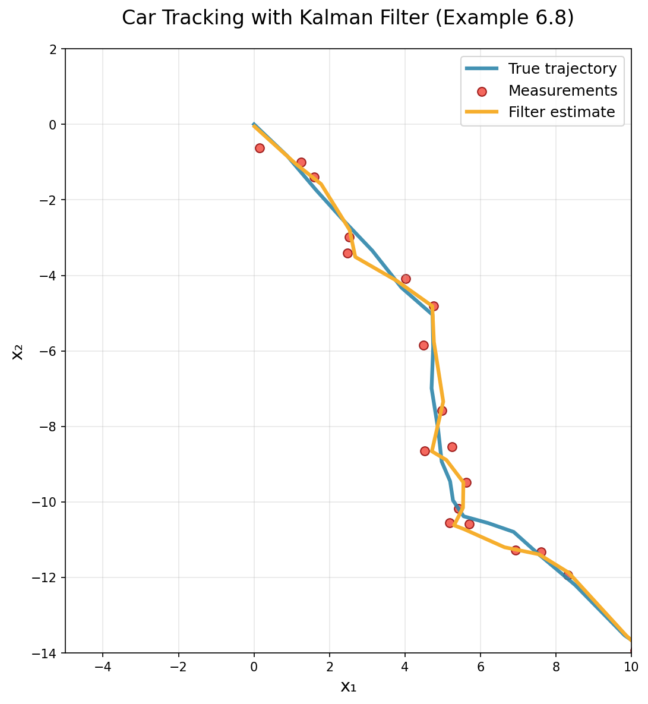

# Quick Start

This guide will get you up and running with `cuthbert` for state-space model inference.
We'll cover the installation procedure and walk through a Kalman filtering example.

## Installation

`cuthbert` depends on JAX, so you'll need to [install JAX](https://docs.jax.dev/en/latest/installation.html) for the available hardware (CPU, GPU, or TPU).
For example, on computers with NVIDIA GPUs:

```bash
pip install -U "jax[cuda12]"
```

Now install `cuthbert` from PyPI:

```bash
pip install cuthbert
```

## Your First Kalman Filter

Let's implement a Kalman filter with `cuthbert`. We'll use Example 6.8 from [Särkka and Svensson (2023)](https://users.aalto.fi/~ssarkka/pub/bfs_book_2023_online.pdf),
where the goal is to track a car's position and velocity in 2D space at discrete time intervals from noisy measurements of its position.

### Setup and imports

```python
import jax
import jax.numpy as jnp
import jax.random as random
import matplotlib.pyplot as plt

from cuthbert import filter
from cuthbert.gaussian import kalman
```

### Generate sample data

We first simulate the system to generate a sequence of observations. The state vector represents the car's position and velocity: $\textbf{x} = (x, y, \dot{x}, \dot{y})$ where $(x, y)$ is the car's position and $(\dot{x}, \dot{y})$ its velocity.

```python
def generate_car_tracking_data(key, num_steps=50):
    # State: [x_pos, y_pos, x_vel, y_vel]
    x_dim = 4
    y_dim = 2  # Observe [x_pos, y_pos] only
    dt = 1.0   # Time step

    # Initial state: car starts at origin moving northeast
    m0 = jnp.array([0.0, 0.0, 1.0, -1.0])  # Initial position and velocity
    chol_P0 = 0.1 * jnp.eye(x_dim)  # Initial uncertainty

    # Dynamics model: discrete-time constant velocity (Eq. 6.32)
    F = jnp.array([
        [1, 0, dt, 0],   # x₁ₖ = x₁ₖ₋₁ + Δt·x₃ₖ₋₁
        [0, 1, 0, dt],   # x₂ₖ = x₂ₖ₋₁ + Δt·x₄ₖ₋₁
        [0, 0, 1, 0],    # x₃ₖ = x₃ₖ₋₁ (velocity x unchanged)
        [0, 0, 0, 1]     # x₄ₖ = x₄ₖ₋₁ (velocity y unchanged)
    ])

    # Process noise covariance Q (discrete-time from continuous model)
    q1_squared = 0.1  # Spectral density q₁²
    q2_squared = 0.1  # Spectral density q₂²
    Q = jnp.array([
        [q1_squared * dt**3 / 3, 0, q1_squared * dt**2 / 2, 0],
        [0, q2_squared * dt**3 / 3, 0, q2_squared * dt**2 / 2],
        [q1_squared * dt**2 / 2, 0, q1_squared * dt, 0],
        [0, q2_squared * dt**2 / 2, 0, q2_squared * dt]
    ])
    chol_Q = jnp.linalg.cholesky(Q)

    # Observation model: observe position only (Eq. 6.33)
    H = jnp.array([
        [1, 0, 0, 0],  # Observe x₁ (x position)
        [0, 1, 0, 0]   # Observe x₂ (y position)
    ])

    # Measurement noise covariance R
    sigma1_squared = 0.1  # Measurement noise variance in x
    sigma2_squared = 0.1  # Measurement noise variance in y
    R = jnp.array([
        [sigma1_squared, 0],
        [0, sigma2_squared]
    ])
    chol_R = jnp.linalg.cholesky(R)

    # Simulate car trajectory with a turning maneuver
    key, sim_key = random.split(key)
    x = m0.copy()
    xs, ys = [], []

    for t in range(num_steps + 1):
        # Record current state and generate observation
        xs.append(x.copy())
        obs_noise = chol_R @ random.normal(random.fold_in(sim_key, t), (y_dim,))
        y = H @ x + obs_noise
        ys.append(y)

        # Simulate next state with dynamics
        if t < num_steps:
            # Add some control input to create a turning trajectory
            if 15 <= t <= 35:  # Turn during middle part of trajectory
                turn_acceleration = jnp.array([0.0, 0.0, -0.05, -0.03])  # Left turn
                x = x + turn_acceleration

            # Apply dynamics with process noise
            process_noise = chol_Q @ random.normal(random.fold_in(sim_key, t + 100), (x_dim,))
            x = F @ x + process_noise

    # Package parameters for cuthbert (time-invariant in this case)
    Fs = jnp.tile(F[None], (num_steps, 1, 1))
    cs = jnp.zeros((num_steps, x_dim))  # No control input in the model
    chol_Qs = jnp.tile(chol_Q[None], (num_steps, 1, 1))

    Hs = jnp.tile(H[None], (num_steps + 1, 1, 1))
    ds = jnp.zeros((num_steps + 1, y_dim))  # No observation bias
    chol_Rs = jnp.tile(chol_R[None], (num_steps + 1, 1, 1))
    ys = jnp.stack(ys)
    true_states = jnp.stack(xs)

    return m0, chol_P0, Fs, cs, chol_Qs, Hs, ds, chol_Rs, ys, true_states

# Generate example data
key = random.key(42)
m0, chol_P0, Fs, cs, chol_Qs, Hs, ds, chol_Rs, ys, true_states = generate_car_tracking_data(key)
```

The state-space model specification for using the Kalman filter in `cuthbert` is as follows:

\begin{align*}
    x_{0} & \sim \mathcal{N}(m_{0}, \mathrm{chol\_P}_{0} \times \mathrm{chol\_P}_{0}^{\top}), \\
    x_{t+1} \mid x_{t} & \sim \mathcal{N}(F_{t} x_{t} + c_{t}, \mathrm{chol\_Q}_{t} \times \mathrm{chol\_Q}_{t}^{\top}), \quad t \in \{0, 1, \ldots, T - 1\}, \\
    y_{t} \mid x_{t} & \sim \mathcal{N}(H_{t} x_{t} + d_{t}, \mathrm{chol\_R}_{t} \times \mathrm{chol\_R}_{t}^{\top}), \quad t \in \{0, 1, \ldots, T\}.
\end{align*}

Note that instead of working with full covariance matrices, we work with their
*square roots* or generalized Cholesky decompositions for improved numerical
stability, denoted by the `chol_` prefix.

### Build the Kalman filter

`cuthbert` uses a functional approach based on **parameter extraction
functions** to build filters. This design pattern allows for flexible handling
of time-varying parameters.

#### The Parameter Extraction Pattern

Instead of passing matrices directly, `kalman.build_filter()` takes three functions that extract the necessary parameters given a time index (or other model inputs):

- **`get_init_params(model_inputs)`**: Returns initial state mean `m0` and noise Cholesky factor `chol_P0`.
- **`get_dynamics_params(model_inputs)`**: Returns dynamics matrix `F`, bias term `c`, and process noise Cholesky factor `chol_Q`.
- **`get_observation_params(model_inputs)`**: Returns observation matrix `H`, bias term `d`, observation noise Cholesky factor `chol_R`, and the actual observation `y`.

This pattern separates the model specification from the filtering algorithm, making the code more modular and allowing the same filter to work with different parameterizations (time-varying, hierarchical, etc.).

??? "Understanding `model_inputs`"
    The `model_inputs` parameter passed to each extraction function can be any
    [pytree](https://docs.jax.dev/en/latest/pytrees.html) that helps identify what parameters to return.
    In the most common case, it's simply a time index, but it could be more complex data like
    hyperparameters or external covariates.

    In our car tracking example, `model_inputs` is just an array of time indices (0, 1, 2, ..., T),
    allowing each function to select the appropriate matrices for that time step. The filtering
    algorithm passes each element of the `model_inputs` array to the extraction functions in sequence.

**Important indexing note**: The `get_dynamics_params` function uses `model_inputs - 1` because dynamics describe transitions from time $t-1$ to $t$, while `get_observation_params` uses `model_inputs` directly since observations occur at each time step.

```python
def build_car_tracking_filter(m0, chol_P0, Fs, cs, chol_Qs, Hs, ds, chol_Rs, ys):

    def get_init_params(model_inputs):
        return m0, chol_P0

    def get_dynamics_params(model_inputs):
        t = model_inputs - 1
        return Fs[t], cs[t], chol_Qs[t]

    def get_observation_params(model_inputs):
        t = model_inputs
        return Hs[t], ds[t], chol_Rs[t], ys[t]

    filter_obj = kalman.build_filter(
        get_init_params, get_dynamics_params, get_observation_params
    )
    model_inputs = jnp.arange(len(ys))
    return filter_obj, model_inputs

filter_obj, model_inputs = build_car_tracking_filter(
    m0, chol_P0, Fs, cs, chol_Qs, Hs, ds, chol_Rs, ys
)
```

### Run the Kalman filter

With the filter built, running the Kalman filter is now as simple as calling the `cuthbert.filter`
function with our constructed filter object and model inputs:

```python
# Run the filter
filtered_states = filter(filter_obj, model_inputs, parallel=True)

# Extract results
means = filtered_states.mean  # Posterior state means
chol_covs = filtered_states.chol_cov  # Cholesky factors of posterior covariances
log_likelihood = filtered_states.log_likelihood  # Log marginal likelihoods
```

!!! tip "Temporal parallelization of the filter"
    The `parallel=True` option enables [temporal parallelization](https://ieeexplore.ieee.org/document/9013038)
    of the filter, which can significantly speed up computation for longer time
    series if a hardware accelerator (GPU or TPU) is available (from
    $\mathcal{O}(T)$ for the sequential filter to $\mathcal{O}(\log T)$ for the
    parallel filter). Our implementation is based on [Yaghoobi et al. (2025)](https://epubs-siam-org.libproxy.aalto.fi/doi/10.1137/23M156121X).

!!! tip "Just-in-time (JIT) compilation for repeated use"
    If you need to run the filter multiple times (e.g., during parameter optimization), you can
    JIT-compile it for better performance with
    [`jax.jit`](https://docs.jax.dev/en/latest/_autosummary/jax.jit.html). All functions in `cuthbert` are
    pure and designed to work seamlessly with JAX function transformations.

    ```python
    jitted_filter = jax.jit(filter, static_argnames=['parallel'])
    filtered_states = jitted_filter(kalman_filter, model_inputs, parallel=True)
    ```

### Visualize the results

Now let's visualize how well our Kalman filter tracked the car's movement. The
plot shows three key elements: the true trajectory (unknown in real
applications), the noisy GPS measurements, and the filtered estimates of the
car's position.

??? "Code to plot the results."
    ```python
    # Extract positions for plotting
    true_pos = true_states[:, :2]  # True x₁, x₂ positions
    obs_pos = ys  # Observed x₁, x₂ positions
    filtered_pos = means[:, :2]  # Filtered x₁, x₂ positions

    # Create the trajectory plot matching the textbook style
    plt.figure(figsize=(10, 8))
    plt.plot(true_pos[:, 0], true_pos[:, 1], '-', color='#2E86AB', linewidth=3,
            label='True trajectory', alpha=0.9)
    plt.scatter(obs_pos[:, 0], obs_pos[:, 1], c='#F24236', edgecolors='darkred',
            s=50, alpha=0.8, label='Measurements')
    plt.plot(filtered_pos[:, 0], filtered_pos[:, 1], '-', color='#F6AE2D', linewidth=3,
            label='Filter estimate')

    # Set labels and styling to match the textbook
    plt.xlabel('x₁', fontsize=14)
    plt.ylabel('x₂', fontsize=14)
    plt.title('Car Tracking with Kalman Filter (Example 6.8)', fontsize=16, pad=20)
    plt.legend(fontsize=12, loc='upper right')
    plt.grid(True, alpha=0.3)

    # Set axis limits to match the reference plot approximately
    plt.xlim(-5, 10)
    plt.ylim(-14, 2)

    # Add some styling to match academic presentation
    plt.gca().set_aspect('equal', adjustable='box')
    plt.tight_layout()

    # Save the plot for documentation
    plt.savefig('docs/assets/car_tracking_example.png', dpi=150, bbox_inches='tight')
    plt.show()

    # Print some statistics
    final_rmse_x = jnp.sqrt(jnp.mean((true_pos[:, 0] - filtered_pos[:, 0])**2))
    final_rmse_y = jnp.sqrt(jnp.mean((true_pos[:, 1] - filtered_pos[:, 1])**2))
    print(f"Filter RMSE - X: {final_rmse_x:.3f}, Y: {final_rmse_y:.3f}")
    ```



??? tip "Bonus: Handle missing observations"
    `cuthbert` automatically handles missing data when observations contain NaN values:

    ```python
    # Create data with missing observations (simulate GPS outage)
    ys_missing = ys.at[20:30, :].set(jnp.nan)  # Missing position observations during turn

    # Rebuild filter with missing data
    filter_obj_missing, model_inputs_missing = build_car_tracking_filter(
        m0, chol_P0, As, cs, chol_Qs, Hs, ds, chol_Rs, ys_missing
    )

    # Run filtering - cuthbert handles NaNs automatically
    filtered_states_missing = filter(filter_obj_missing, model_inputs_missing)

    print("Successfully handled missing observations!")
    print(f"Missing observation period: steps 20-30 during the car's turn")
    print(f"Filter uncertainty automatically increased during GPS outage")
    ```

## Recap

Congratulations! You've successfully implemented a complete Kalman filtering solution with `cuthbert`. The key steps were:

1. **Model specification**: Specify the matrices and vectors that define the linear-Gaussian
   state-space model, and collect/generate observations.
2. **Filter construction**: Use the parameter extraction pattern with `kalman.build_filter()` to create a flexible filter object.
3. **Filtering**: Execute the algorithm with `cuthbert.filter()` to obtain posterior state
   estimates.

This functional approach makes `cuthbert` naturally compatible with JAX's ecosystem, enabling automatic differentiation, JIT compilation, and vectorization for your state-space modeling needs.

## Next Steps

- **Smoothing**: Use `cuthbert.smoother` for backward pass smoothing.
- **Parameter Learning**: Combine with optimization libraries like `optax`.
- **Sequential Monte Carlo**: Explore nonlinear and non-Gaussian filtering with `cuthbert.smc`.
- **Advanced Models**: Check out extended and unscented Kalman filters for nonlinear state-space
models.
